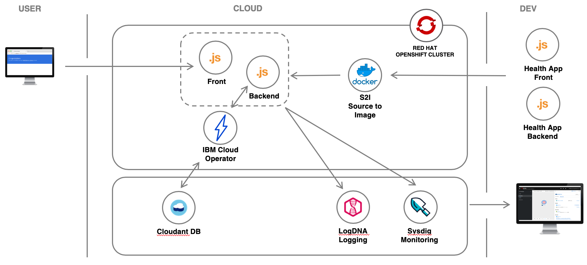

# Red Hat OpenShift 4 on IBM Cloud - Bring it all together

A recent study by McKinsey & Company reveals that only 20 percent of enterprise applications have moved to the cloud. We believe that a hybrid cloud approach, built on open source and a vibrant open ecosystem, is the best way to move the remaining 80 percent.

Red Hat OpenShift represents a common platform, based on the industry-standard Kubernetes, that allows you to build on premises, on the IBM Cloud, or on any other leading cloud platform. You want freedom of choice; Red Hat OpenShift offers exactly that.

## Objectives

* To familiarize yourself with OpenShift 4
* Deploy a Node.js application to OpenShift
* Use OpenShift's features to monitor, scale the application

## Architecture

1. A developer generates a starter application with IBM Cloud Developer Tools.
1. Building the application produces a Docker container image.
1. The image is pushed to a project in OpenShift cluster.
1. The application is deployed to a OpenShift cluster.
1. Users access the application.
1. A developer connects the application to a Cloudant database with Operator.
1. A developper monitors the app with LogDNA and Sysdig.

## Services used

This tutorial uses the following Cloud Services:
* [Red Hat OpenShift on IBM Cloud](https://cloud.ibm.com/kubernetes/catalog/create?platformType=openshift)
* [Cloudant](https://cloud.ibm.com/catalog/services/cloudant)
* [IBM Log Analysis with LogDNA](https://cloud.ibm.com/observe/logging/create)
* [IBM Cloud Monitoring with Sysdig](https://cloud.ibm.com/observe/monitoring/create)

## Agenda

### Getting Started
* [Create account and get cluster](getting-started/get_started.md)
* [Access the cluster using the command line](getting-started/setup_cli.md)

### Part 1 - Learning OpenShift
* [1.1. Deploying an application](part1-learn_openshift/exercise-1.md)
* [1.2. Logging and monitoring](part1-learn_openshift/exercise-2.md)
* [1.3. Metrics and dashboards](part1-learn_openshift/exercise-3.md)
* [1.4. Scaling the application](part1-learn_openshift/exercise-4.md)

### Part 2 - OpenShift and IBM Cloud
* [2.5. Cloudant DB with IBM Cloud Operator](part2-openshift_ibmcloud/exercise-5.md)
* [2.6. Configure the Sysdig Agent](part2-openshift_ibmcloud/exercise-6.md)
* [2.7. Configure the LogDNA Agent](part2-openshift_ibmcloud/exercise-7.md)
* [2.8. Analyze your logs with LogDNA](part2-openshift_ibmcloud/exercise-8.md)
* [2.9. Monitor your Cluster with SysDig](part2-openshift_ibmcloud/exercise-9.md)

## Credits

Many folks have contributed to help shape, test, and contribute the workshop.

* [Sai Vennam](https://github.com/svennam92)
* [Lionel Mace](https://github.com/lionelmace)
* [Marisa Lopez de Silanes Ruiz](https://github.com/lopezdsr)

