# Analyze your logs with LogDNA

IBM Log Analysis with LogDNA is a co-branded service that you can include as part of your IBM Cloud architecture to add log management capabilities. IBM Log Analysis with LogDNA is operated by LogDNA in partnership with IBM. [Learn more](https://cloud.ibm.com/docs/Log-Analysis-with-LogDNA?topic=LogDNA-getting-started).

You can use IBM Log Analysis with LogDNA to manage system and application logs in IBM Cloud.

 IMPORTANT: Use Chrome to complete this exercise. 

## Launch the LogDNA webUI

You launch the web UI within the context of an IBM Log Analysis with LogDNA instance, from the IBM Cloud UI. 

1. Select your instance.

1. Click **View LogDNA**.

   

The Web UI opens.


## Create a custom view

In LogDNA, you can configure custom views to monitor a subset of data. You can also attach an alert to a view to be notified of the presence or absence of log lines.

When you launch the LogDNA web UI, log entries are displayed with a predefined format. You can modify in the **User Preferences** section how the information in each log line is displayed. You can also filter logs and modify search settings, then bookmark the result as a _view_. You can attach and detach one or more alerts to a view. You can define a custom format for how your lines are shown in the view. You can expand a log line and see the data parsed.

## View events with the default format

1. In the LogDNA web UI, click the **Views** icon .
2. Select **Everything** to see all the events.

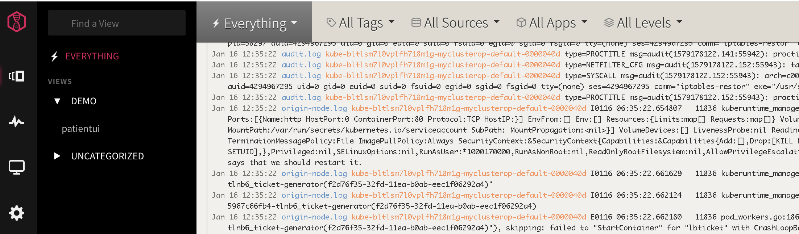

## Customize your default view

In the **USER PREFERENCES** section, you can modify the order of the data fields that are displayed per line.

1. Select the **Configuration** icon 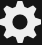.
2. Select **USER PREFERENCES**. A new window opens.
3. Select **Log Format**.
4. Modify the _Line Format_ section to match your requirements. Drag boxes around. Click **Done**.

    For example, add **%app** after the timestamp.

    


## Create a custom view to monitor logs

You can select the events that are displayed through a view by applying a search query in the search bar, selecting values in the search area, or a combination of both. You can save that view for reuse later.

1. In the LogDNA web UI, filter out the logs for the sample app that you have delpoyed in the cluster in previous steps.

   From the Openshift console, go to the developer view. Select the project where you have deployed the sample app, and get the pod name. For example: `patient-ui-8658f89574-rgjw8` 

   

2. Enter in the search bar the following query: `host:{podName}` where {podName} is the name of your pod. For example: `host:patient-ui-8658f89574-rgjw8`

   

   Click enter.

3. Filter out log lines to display only lines that are tagged as debug lines. 

   Add in the search bar the following query: `level:debug` and click enter. The view will show lines that meet the filter and search criteria. For example: `host:patient-ui-8658f89574-rgjw8 level:debug` 

   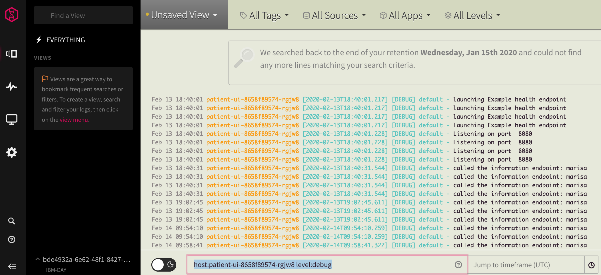

4. Save the custom view.

   Click **Unsaved view**. Select **Save view**.

   

   Enter the name of the view. Use the following format: `<Enter your user name> patientUI`. For example, `marisa patientui`

   Enter a category. Use the following format: `<Enter your user name>`. For example, `marisa` Then click **Add new category**.

   Click **Save view**.

A new category appears on the left navigation panel.


### Generate application log data

Generate logs:

1. Run `oc status`.
2. Get the application URL.

    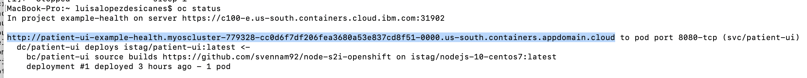

3. Launch the application from a browser. Enter in the browser the application URL. Then, log in and log out with different names to see login entries for each user.

    

## Analyze a log line

At any time, you can view each log line in context.

Complete the following steps:

1. Click the **Views** icon .
2. Select **Everything** or a view.
3. Identify a line in the log that you want to explore.
4. Expand the log line.

   Information about line identifiers, tags, and labels is displayed.

5. Click **View in Context** to see the log line in context of other log lines from that host, app, or both. This is a very useful feature when you want to troubleshoot a problem.

   

   A new pop up window opens.

   

   Choose one of the following options:

   **By Everything** to see the log line in the context of all log records \(everything\) that are available in the LogDNA instance.

   **By source** to see the log line in the context of the log lines for the same source.

   **By App** to see the log line in the context of the log lines of the app.

   **By Source and App** to see the log line in the combined context of the app and source.

   Then click **Continue in New Viewer** to get the view in a different page. You might need to scroll down to get this option.

   > **Tip: Open a view per type of context to troubleshoot problems.**

6. Click **Copy to clipboard** to copy the message field to the clipboard. 

    For example, the log record in the UI looks like:

    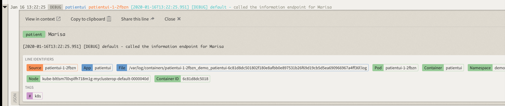

    When you copy the record, you get:

    ```
    [2020-01-16T13:22:25.951] [DEBUG] default - called the information endpoint for Marisa
    ```

    Notice that when you copy the log record you get less information than what it is displayed in the view. To get a line with all the fields, you must export data from a custom view. 

When you are finished, close the line.

## View a subset of the events by applying a timeframe

In a view, you can search events that are displayed through a view for a specific timeframe.

You can apply a timestamp by specifying an absolute time, a relative time, or a time range.

Complete the following steps to jump to a specific time: 

1. Launch the LogDNA web UI. 

2. Click the **Views** icon . 

3. Select your custom view. 

4. Enter a time query. Choose any of the following options:

    Enter an absolute time to jump to a point in time in your events such as `January 27 10:00am`.

    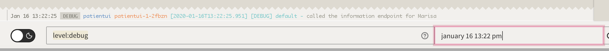

    Enter a relative time such as `5 days ago`. 

    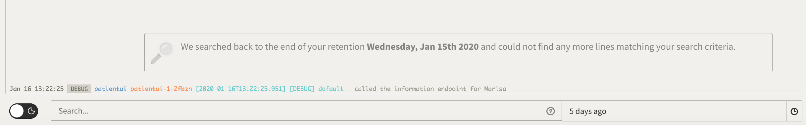

    You can also enter a time range such as `yesterday 10am to yesterday 11am`, `last fri 4:30pm to 11/12 1 AM`, `last wed 4:30pm to 23/05 1 AM`, or `May 20 10am to May 22 10am`. Make sure to include `to` to separate the initial timestamp from the end timestamp.

    Click **ENTER**.

You might get the error message: `Your request is taking longer than expected, try refreshing your browser in a bit as we try to catch up. Retry.` You might get this error when the timeframe that you have specified does not have any events available to show. Change the time query, and retry.

## Create a dashboard

You can create a dashboard to monitor your app graphically through interactive graphs.

For example, you can use graphs to analyze patterns and trends over a period of time.

Complete the following steps to create a dashboard to monitor logs from the lab's sample app:

1. In the LogDNA web UI, click the **Boards** icon .
2. Select **NEW BOARD** to create a new dashboard.
3. Click **Add graph**.
4. Select the field **host**, then select the value that matches your pod name.

   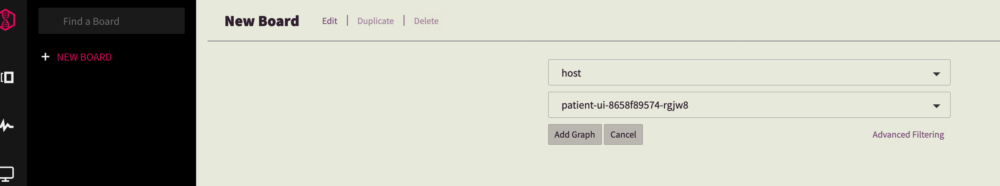

   Click **Add graph**.

   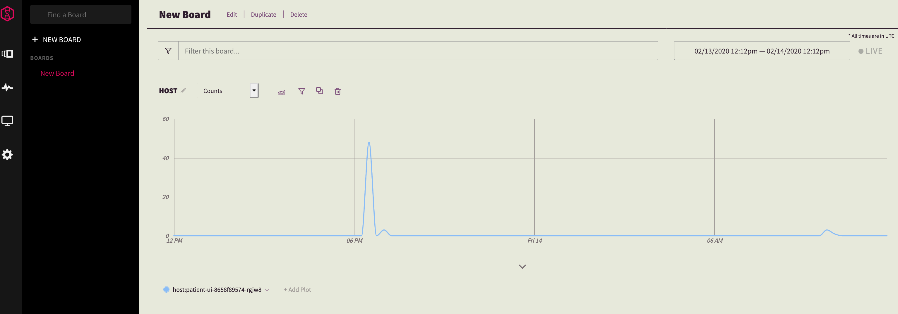

5. Open a view that displays the logs for the patientui app. Click the graph in a peak of data at the time that you want to see logs, and then click **Show logs**.

   

   A new page opens with the relevant log entries.

6. Add subplots to analyze the data by applying additonal filtering criteria.

   

   Click **Show subplots**.

   Select **Histogram** and **level**.

   

7. Name the dashboard by hitting "Edit".

   Enter `patientui` as the name of the dashboard.

   Enter a category. Use the following format: `<Enter your user name>` For example, `marisa` Then click **Add new category**.

   Click **Save**.

A new category appears on the left navigation panel.

## Create a screen to monitor your app

You can create a screen to monitor your app graphically through metrics \(counters\), operational KPIs \(gauges\), tables, and time-shifted graphs \(graphs that you can use to analyze patterns and trends for comparison analysis\).

Complete the following steps to create a dashboard to monitor logs from the lab's sample app:

1. In the LogDNA web UI, click the **screens** icon .
2. Select **NEW SCREEN**.
3. Click **Add Widget** and select **Count**.

   Click the widget. You will get the configuration fields for this widget.

   To configure the _Count_ widget to report on the log lines for the application patientui, you must select the field **app**, and set the value to **patientui**.

   You can also add a label, by entering a value for the _label_ field -- for example `App PatientUI`

   The widget should look similar to the following one:

   

4. Add a gauge.

   Click **Add Widget**.

   Select **Gauge**.

   Click the widget. You will get the configuration fields for this widget.

   To configure the _Gauge_ widget to report on the debug log lines for the application patientui, you must select the field **level**, and set the value to **debug**. Then, set the advanced condition `app:patientui`. The duration is set to the default, last 1 day.

   

   Add a label, by entering a value for the _label_ field. Enter `PatientUI - INFO`. Also add the gauge limits `0` for Minimum and `5000` for maximum.

   The widget should look similar to the following one:

   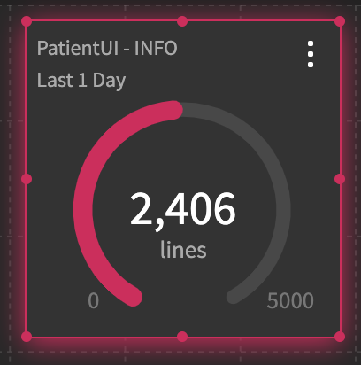

5. Add a table.

   Click **Add Widget**.

   

   Select **Table**.

   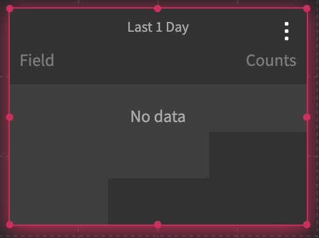

   Click the widget. You will get the configuration fields for this widget.

   To list the number of records in the last 24 hours for the cluster namespaces, set `Group By` to **namespace**.

   

   Change the default number of rows from 3 to 10.

   The widget should look similar to the following one:

   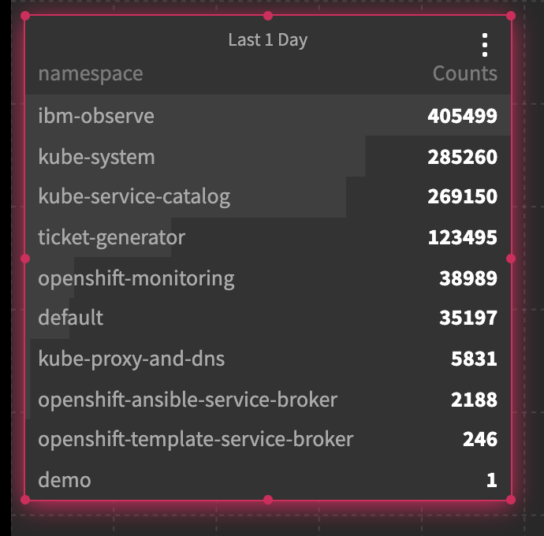

6. Save the screen. Select **Save Screen**.

   IMPORTANT: If you do not save the screen, you lose all your widgets.


Find more about IBM Log Analysis with LogDNA in the [IBM Cloud documentation](https://cloud.ibm.com/docs/services/Log-Analysis-with-LogDNA/index.html#getting-started).

