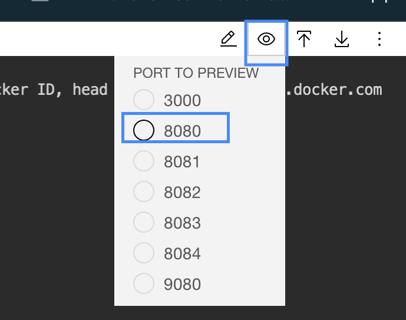
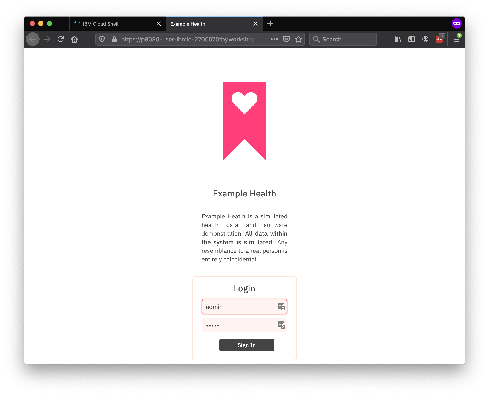
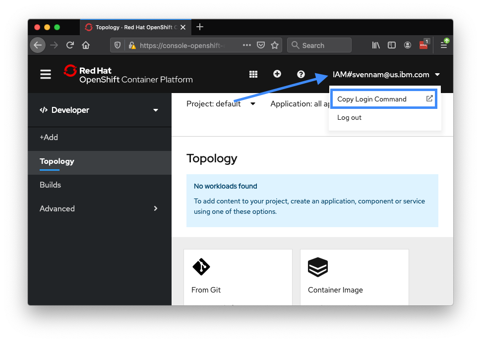

# Exercise 1: Deploying an application

In this exercise, you'll deploy a simple Node.js Express application - "Example Health". Example Health is a simple UI for a patient health records system. We'll use this example to demonstrate key OpenShift features throughout this workshop. You can find the sample application GitHub repository here: [https://github.com/IBM/node-s2i-openshift](https://github.com/IBM/node-s2i-openshift)


1. Get the source code for the `Example Health` app

    * Clone the Example Health repo and `cd` to it:
    
        ```console
        git clone https://github.com/IBM/node-s2i-openshift
        cd node-s2i-openshift
        ```

    * The Node.js application is in the "site" directory. `cd` to it, install the `npm` dependencies, and run the `Health Example` app on the localhost:

        ```console
        cd site
        npm install
        npm start
        ```
    * To access the application, use the "Port" previewer and select `8080`:
    
        

    * You should see the Example Health application. Login with `admin:admin` and click around!

        

1. Run the Example Health app with Docker,

    * In the directory `./site` create a new file `Dockerfile`,

        ```console
        touch Dockerfile
        ```

    * Edit the `Dockerfile` and add the following commands,

        ```console
        cat <<EOF >> Dockerfile
        FROM node:10-slim

        USER node

        RUN mkdir -p /home/node/app
        WORKDIR /home/node/app

        COPY --chown=node package*.json ./
        RUN npm install
        COPY --chown=node . .

        ENV HOST=0.0.0.0 PORT=3000

        EXPOSE 3000
        CMD [ "node", "app.js" ]
        EOF
        ```

    * Run the app with Docker,

        ```console
        docker build -t example-health .
        docker run -d --name example-health -p 3000:3000 example-health
        ```

        You should see output like:

        ```console
        4cfa29efa8697717372f932935de008f35bc11d57376b612340e61a9b9a7489e
        ```

    * Access your application listening on port 3000:

        

    * Clean up the docker container

        ```console
        docker kill example-health
        ```

1. Build and Push the Image to your IBM Cloud Container Registry.

    * Create a new namespace with `ibmcloud cr namespace-add <unique_name>`, or check if you already have one with `ibmcloud cr namespace-list`

        ```console
        ibmcloud cr namespace-add <unique_name>
        ```

        Example Output:
        ```console
        Adding namespace 'saifaststart'...
        Successfully added namespace 'saifaststart'
        OK
        ```

        Check your namespaces with the following command:
        ```console
        ibmcloud cr namespace-list
        ```

    * Log-in to the IBM Cloud Container Registry

        ```console
        ic cr login
        ```

        Output:
        ```console
        Logging in to 'registry.ng.bluemix.net'...
        Logged in to 'registry.ng.bluemix.net'.

        Logging in to 'us.icr.io'...
        Logged in to 'us.icr.io'.
        ```

    * Note the region -- `<region>.icr.io`. This will be the region where you tag/push your Docker image. Tag your Docker Image to this registry, and then push it:

        ```console
        docker tag example-health <region>.icr.io/<namespace>/example-health:latest
        docker push <region>.icr.io/<namespace>/example-health:latest
        ```

        Example Command and Output:
        ```console
        $ docker tag example-health us.icr.io/saifaststart/example-health:latest
        $ docker push us.icr.io/saifaststart/example-health:latest
        The push refers to repository [us.icr.io/saifaststart/example-health]
        cb1a3936aacf: Pushed 
        71a1fdd16f89: Pushed 
        f1272de5a784: Pushed 
        5cd86f8a23e9: Pushed 
        56e59cd1a84a: Pushed 
        3939db7805e0: Pushed 
        32c382d9c13a: Pushed 
        62dac45972d5: Pushed 
        814c70fdae62: Pushed 
        latest: digest: sha256:0cfec7de3aa068ce1468c871e682eef2107f3b0a83738cd7ab7850121a4416e6 size: 2205
        ```

1. You're now ready to push this application into OpenShift! First, you'll need to configure your `oc` CLI to connect to your cluster.

    * Run `ibmcloud ks clusters` to find the name of your cluster. Then, run the following command to get the URL to the dashboard:
    
        ```console
        ibmcloud ks cluster get <your_cluster_name> | grep "Public Service Endpoint URL"
        ```

        Output:
        ```console
        Public Service Endpoint URL:    https://your_cluster_dashboard_url:32545   
        ```

    * Navigate to that URL in the same browser that you used to log-in to IBM Cloud. You should see your OpenShift dashboard! Take a second to look around, and then copy the login command for the CLI:

    

    Your login command should look something like:

        ```console
        oc login --token=WmBWdgg1eObMBIYOlQAafeDKdUUUwNDaRCR1Rf7YkVc0 --server=https://c100-e.containers.cloud.ibm.com:32545
        ```
    
    * Navigate back to your terminal, and run that command.

    * That's it! Your CLI is now connected to your Red Hat OpenShift cluster running in IBM Cloud.

1. Create a new project


    * From the logged in user drop down in the top right of the web console, select `Copy Login Command`,
    * The login command will be copied to the clipboard,
    * In your terminal, paste the login command, e.g.

        ```console
        oc login https://c100-e.us-south.containers.cloud.ibm.com:30403 --token=jWX7a04tRgpdhW_iofWuHqb_Ygp8fFsUkRjOK7_QyFQ
        ```

1. Create a new Project

    * Create a new project `example-health-ns`,

        ```console
        $ oc new-project example-health-ns
        Now using project "example-health-ns" on server "https://c100-e.us-south.containers.cloud.ibm.com:30403".

        You can add applications to this project with the 'new-app' command. For example, try:

            oc new-app centos/ruby-25-centos7~https://github.com/sclorg/ruby-ex.git

        to build a new example application in Ruby.
        ```

    * Use the `example-health-ns` project,

        ```console
        $ oc project example-health-ns
        Already on project "example-health-ns" on server "https://c100-e.us-south.containers.cloud.ibm.com:30403".
        $ oc project
        Using project "example-health-ns" on server "https://c100-e.us-south.containers.cloud.ibm.com:30403".
        ```

1. Deploy the `Example Health` app using the Docker image,

    * Create the application, and replace `<username>` by the username of your Docker Hub account,

        ```console
        $ oc new-app <username>/example-health:1.0.0
        --> Found Docker image aaf90ce (8 minutes old) from Docker Hub for "<username>/example-health:1.0.0"

            * An image stream tag will be created as "example-health:1.0.0" that will track this image
            * This image will be deployed in deployment config "example-health"
            * Port 3000/tcp will be load balanced by service "example-health"
            * Other containers can access this service through the hostname "example-health"

        --> Creating resources ...
            imagestream.image.openshift.io "example-health" created
            deploymentconfig.apps.openshift.io "example-health" created
            service "example-health" created
        --> Success
            Application is not exposed. You can expose services to the outside world by executing one or more of the commands below:
            'oc expose svc/example-health'
            Run 'oc status' to view your app.
        ```

    * This will create an ImageStream, Deployment, a Pod, and a Service resource for the `Example-Health` app,

1. Expose the `Example-Health` service,

    * The last thing to do is to create a route. By default, services on OpenShift are not publically available. A route will expose the service publically to external traffic.

        ```console
        $ oc expose svc/example-health
        route.route.openshift.io/example-health exposed
        ```

    * View the status,

        ```console
        $ oc status
        In project example-health-ns on server https://c100-e.us-south.containers.cloud.ibm.com:30403

        http://example-health-example-health-ns.cda-openshift-cluster-1c0e8bfb1c68214cf875a9ca7dd1e060-0001.us-south.containers.appdomain.cloud to pod port 3000-tcp (svc/example-health)
        dc/example-health deploys istag/example-health:1.0.0
            deployment #1 deployed 5 minutes ago - 1 pod

        2 infos identified, use 'oc status --suggest' to see details.
        ```

1. Review the `Example-Health` app in the web console,

    * Go to `My Projects` via URI `/console/projects`,

        

    * Select the project `example-health-ns`, unfold the `DEPLOYMENT CONFIG` for `example-health` application details,

        

    * In the `NETWORKING` section, click the `Routes - External Traffic` link, e.g. `http://example-health-example-health-ns.cda-openshift-cluster-1c0e8bfb1c68214cf875a9ca7dd1e060-0001.us-south.containers.appdomain.cloud`

    * This opens the Example Health app in a new tab of your browser,
    * Login with `admin:test`,

        

## You're done

Congratulations on completing the lab!


## Deploy Example Health

Access your cluster on the [IBM Cloud clusters dashboard](https://cloud.ibm.com/kubernetes/clusters). Click the `OpenShift web console` button on the top-right. (This is a pop-up so you'll need to white list this site.)

Once you're in the OpenShift dashboard, switch to the "Developer" view:


oc create -f https://raw.githubusercontent.com/openshift/origin/master/examples/image-streams/image-streams-rhel7.json -n openshift


Create a project, you can title it whatever you like, we suggest "example-health."


Click on your new project. You should see a view that looks like this:


Click on the browse catalog button and scroll down to the `Node.js` image. Click on that catalog button.


Click through to the second step for configuration, and choose `advanced options`. \( a blue hyperlink on the bottom line \)


You'll see an advanced form like this:


Enter the repository: `https://github.com/IBM/node-s2i-openshift` and `/site` for the 'Context Dir'. Click 'Create' at the bottom of the window to build and deploy the application.

Scroll through to watch the build deploying:


When the build has deployed, click the 'External Traffic Route', and you should see the login screen like the following:


You can enter any strings for username and password, for instance `test:test` because the app is running in demo mode.

Congrats! You've deployed a `Node.js` app to Kubernetes using OpenShift Source-to-Image (S2I).

## Understanding What Happened

[S2I](https://docs.openshift.com/container-platform/3.6/architecture/core_concepts/builds_and_image_streams.html#source-build) is a framework that creates container images from source code, then runs the assembled images as containers. It allows developers to build reproducible images easily, letting them spend time on what matters most, developing their code!

## Git Webhooks

So far we have been doing alot of manual deployment. In cloud-native world we want to move away from manual work and move toward automation. Wouldn't it be nice if our application rebuilt on git push events? Git webhooks are the way its done and openshift comes bundled in with git webhooks. Let's set it up for our project.

To be able to setup git webhooks, we need to have elevated permission to the project. We don't own the repo we have been using so far. But since its opensource we can easily fork it and make it our own.

Fork the repo at [https://github.com/IBM/node-s2i-openshift](https://github.com/IBM/node-s2i-openshift)


Now that I have forked the repo under my repo I have full admin priviledges. As you can see I now have a settings button that I can change the repo settings with.


We will come back to this page in a moment. Lets change our git source to our repo.

From our openshift dashboard for our project. Select `Builds > Builds`


Select the patientui build. As of now this should be the only build on screen.


Click on `Action` on the right and then select `Edit`


Change the `Git Repository URL` to our forked repository.

Click Save in the bottom.


You will see this will not result in a new build. If you want to start a manual build you can do so by clicking `Start Build`. We will skip this for now and move on to the webhook part.

Click on `Configuration` tab.

Copy the GitHub Webook URL.

The webhook is in the structure

```
https://c100-e.us-east.containers.cloud.ibm.com:31305/apis/build.openshift.io/v1/namespaces/example-health/buildconfigs/patientui/webhooks/<secret>/github
```


> There is also the generic webhook url. This also works for github. But the github webhook captures some additional data from github and is more specific. But if we were using some other git repo like bitbucket or gitlab we would use the generic one.

In our github repo go to `Setting > Webhooks`. Then click `Add Webhook`


In the Add Webhook page fill in the `Payload URL` with the url copied earlier from the build configuration. Change the `Content type` to `application/json`.

> **NOTE**: The *Secret* field can remain empty.

Right now just the push event is being sent which is fine for our use.

Click on `Add webhook`


If the webhook is reachable by github you will see a green check mark.

Back in our openshift console we still would only see one build however. Because we added a webhook that sends us push events and we have no push event happening. Lets make one. The easiest way to do it is probably from the Github UI. Lets change some text in the login page.

Path to this file is `site/public/login.html` from the root of the directory. On Github you can edit any file by clicking the Pencil icon on the top right corner.


Let's change the name our application to `Demo Health` (Line 21, Line 22). Feel free to make any other UI changes you feel like.


Once done go to the bottom and click `commit changes`.

Go to the openshift build page again. This happens quite fast so you might not see the running state. But the moment we made that commit a build was kicked off.


In a moment it will show completed. Navigate to the overview page to find the route.


> You could also go to `Applications > Routes` to find the route for the application.

If you go to your new route you will see your change.


