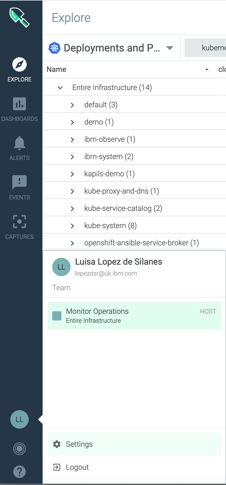
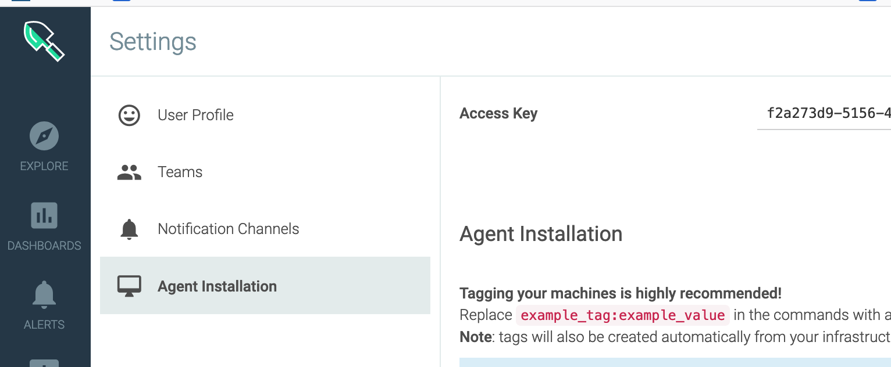

# Exercise 7: Configure the Sysdig Agent

To integrate your monitoring instance with your OpenShift cluster, you must run a script that creates a project and privileged service account for the Sysdig agent.

## Step 1. Access your cluster through the CLI

[Access your cluster using the oc CLI](../getting-started/setup_cli#access-your-cluster-using-the-oc-cli).

## Step 2. Launch the Sysdig webUI

You launch the web UI within the context of an IBM Cloud Monitoring with Sysdig instance, from the IBM Cloud UI. 

Complete the following steps to launch the web UI:

1. Click the **Menu** icon  &gt; **Observability**. 

2. Select **Monitoring**. 

    The list of instances that are available on IBM Cloud is displayed.

3. Select your instance. Check with the instructor which instance  you should use for the lab.

4. Click **View Sysdig**.

The Web UI opens.

## Step 3. Get the access key for your Sysdig instance

The Sysdig access key is used to open a secure web socket to the Sysdig ingestion server and to authenticate the monitoring agent with the monitoring service.

Comnplete the following steps:

1. In the Sysdig web UI, select the icon .

2. Select **Settings**.

    

3. Select **Agent installation**.

    

4. Copy the access key that is displayed at the top of the page.


## Step 4. Deploy the Sysdig agent in the cluster

Run the script to set up an `ibm-observe` project with a privileged service account and a Kubernetes daemon set to deploy the Sysdig agent on every worker node of your Kubernetes cluster.

The Sysdig agent collects metrics such as the worker node CPU usage, worker node memory usage, HTTP traffic to and from your containers, and data about several infrastructure components.

In the following command, replace `<sysdig_access_key>` and `<sysdig_collector_endpoint>` with the values from the service key that you created earlier. For `<tag>`, you can associate tags with your Sysdig agent, such as `role:service,location:us-south` to help you identify the environment that the metrics come from.

```text
curl -sL https://ibm.biz/install-sysdig-k8s-agent | bash -s -- -a <sysdig_access_key> -c <sysdig_collector_endpoint> -t faststart,<Enter your name> -ac 'sysdig_capture_enabled: false' --openshift
```

For example:

```text
curl -sL https://ibm.biz/install-sysdig-k8s-agent | bash -s -- -a <sysdig_access_key> -c <sysdig_collector_endpoint> -t faststart,marisa -ac 'sysdig_capture_enabled: false' --openshift
```

Example output:

```text
    * Detecting operating system
    * Downloading Sysdig cluster role yaml
    * Downloading Sysdig config map yaml
    * Downloading Sysdig daemonset v2 yaml
    * Creating project: ibm-observe
    * Creating sysdig-agent serviceaccount in project: ibm-observe
    * Creating sysdig-agent access policies
    * Creating sysdig-agent secret using the ACCESS_KEY provided
    * Retreiving the IKS Cluster ID and Cluster Name
    * Setting cluster name as <cluster_name>
    * Setting ibm.containers-kubernetes.cluster.id 1fbd0c2ab7dd4c9bb1f2c2f7b36f5c47
    * Updating agent configmap and applying to cluster
    * Setting tags
    * Setting collector endpoint
    * Adding additional configuration to dragent.yaml
    * Enabling Prometheus
    configmap/sysdig-agent created
    * Deploying the sysdig agent
    daemonset.extensions/sysdig-agent created
```

## Step 5. Verify that the Sysdig agent is deployed successfully

Verify that the `sydig-agent` pods on each node have a **Running** status.

Run the following command:

```text
oc get pods -n ibm-observe
```

Example output:

```text
    NAME                 READY     STATUS    RESTARTS   AGE
    sysdig-agent-qrbcq   1/1       Running   0          1m
    sysdig-agent-rhrgz   1/1       Running   0          1m
```


