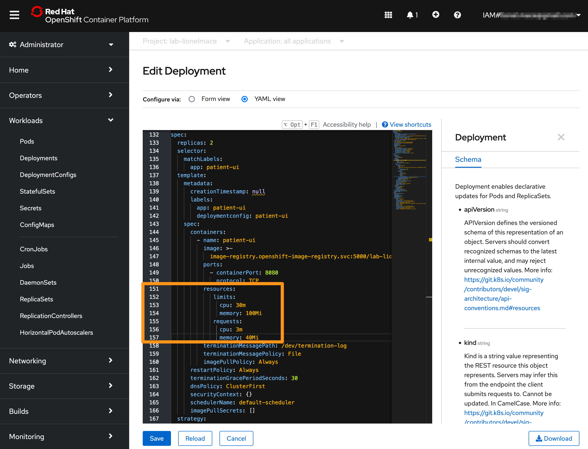
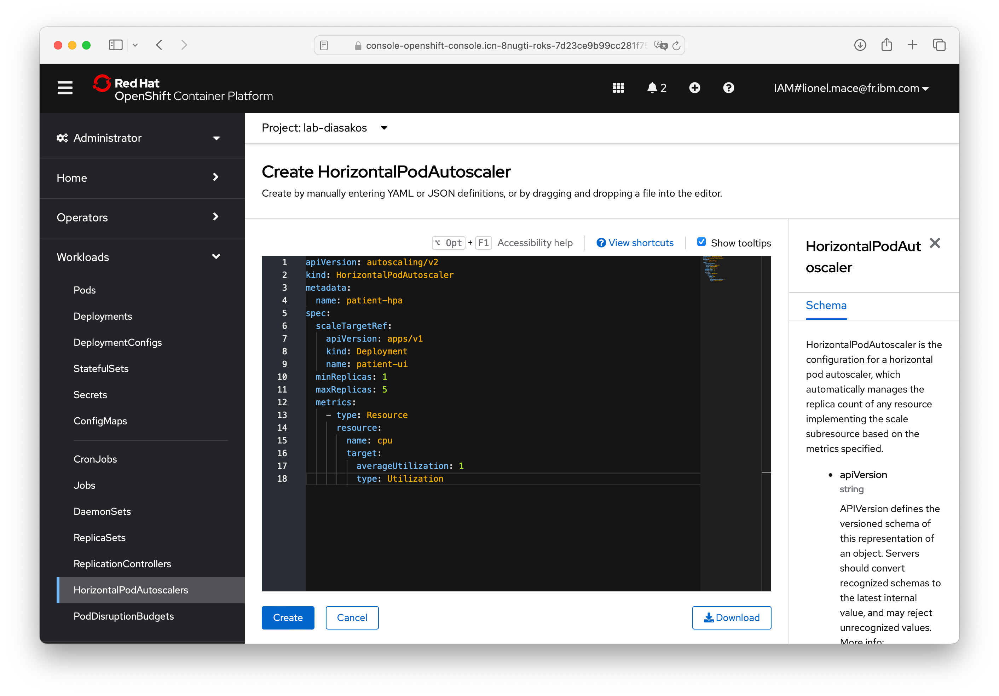
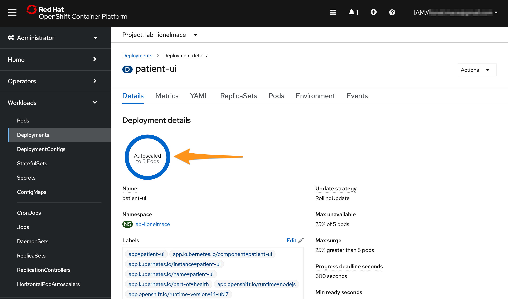

# Scaling the application

In this section, you will learn how to manually and automatically scale your application.

We'll also leverage the metrics we've observed in the previous step to automatically scale our UI application in response to load.

## Manual scaling

1. You can achieve manual scaling of your pods with `oc scale` command. The command sets a new size for a deployment configuration or replication controller

  ```sh
  oc scale deployment/patient-ui --replicas=2
  ```

1. You can see a new pod being provisioned by running this command.

  ```sh
  oc get pods
  ```

## Enable Resource Limits

Before we can setup autoscaling for our pods, we first need to set resource limits on the pods running in our cluster. Limits allows you to choose the minimum and maximum CPU and memory usage for a pod.

Hopefully you have your running script simulating load from **Step 2.2 Simulate load on the application**, Grafana showed you that your application was consuming anywhere between ".002" to ".02" cores. This translates to 2-20 "millicores". That seems like a good range for our CPU request, but to be safe, let's bump the higher-end up to 30 millicores. In addition, Grafana showed that the app consumes about `25`-`35` MB of RAM. Set the following resource limits for your deployment now.

1. Switch to the **Administrator** view and then navigate to **Workloads > Deployments** in the left-hand bar. Choose the `patient-ui` Deployment, then choose **Actions > Edit Deployment**.

    

2. Switch to the the YAML view, search the section **template > spec > containers** to add some resource limits. Replace the `resources {}` (line 161), and ensure the spacing is correct -- YAML uses strict indentation.

    

  ```yaml
             resources:
               limits:
                 cpu: 30m
                 memory: 100Mi
               requests:
                 cpu: 3m
                 memory: 40Mi
  ```

1. Click **Save**.

## Enable Autoscaler

Now that we have resource limits, let's enable autoscaler.

By default, the autoscaler allows you to scale based on CPU or Memory. The UI allows you to do CPU only \(for now\). Pods are balanced between the minimum and maximum number of pods that you specify. With the autoscaler, pods are automatically created or deleted to ensure that the average CPU usage of the pods is below the CPU request target as defined. In general, you probably want to start scaling up when you get near `50`-`90`% of the CPU usage of a pod.
In our case, let's make it `1`% to test the autoscaler since we are generating minimal load.

1. Navigate to **Workloads > Horizontal Pod Autoscalers**, then hit **Create Horizontal Pod Autoscaler**.

    

    ```yaml
    apiVersion: autoscaling/v2
    kind: HorizontalPodAutoscaler
    metadata:
      name: patient-hpa
    spec:
      scaleTargetRef:
        apiVersion: apps/v1
        kind: Deployment
        name: patient-ui
      minReplicas: 1
      maxReplicas: 5
      metrics:
        - type: Resource
          resource:
            name: cpu
            target:
              averageUtilization: 1
              type: Utilization
    ```

1. Hit **Create**.

    > If you get the error "User cannot create resource horizontalpodautoscalers in API group autoscaling in the namespace example-health", make sure to enter the correct project/namespace.

## Test Autoscaler

If you're not running the script from the [previous exercise](ex-2-log.md#simulate-load-on-the-application), the number of pods should stay at 2.

1. Check by going to the **Details** page of **Deployments**.

    

1. Start simulating load by hitting the page several times, or running the script. You'll see that it starts to scale up:

   

That's it! You now have a highly available and automatically scaled front-end Node.js application. OpenShift is automatically scaling your application pods since the CPU usage of the pods greatly exceeded `1`% of the resource limit, `30` millicores.

## Optional

1. To get additional information about the horizontal pod autoscaler, run the command

    ```sh
    oc get hpa
    ```

    > Remember to switch to your project first with `oc project <project-name>`.

1. The autoscaler can also be created with this command

    ```sh
    oc autoscale deployment/patient-ui --min 1 --max 10 --cpu-percent=1
    ```
