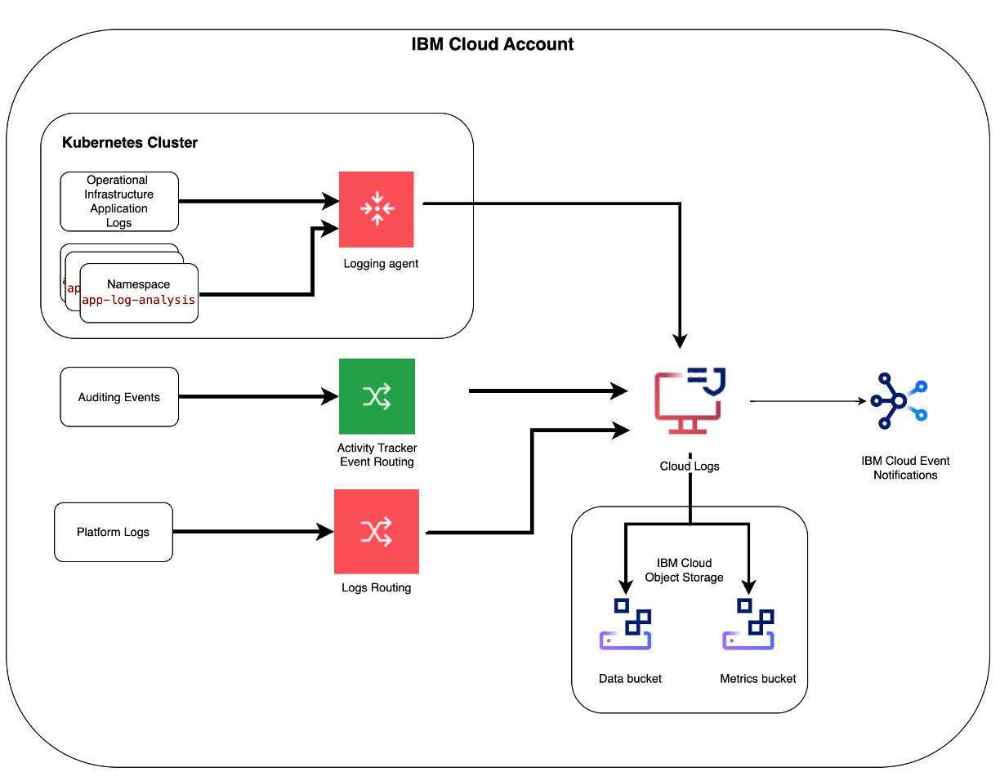
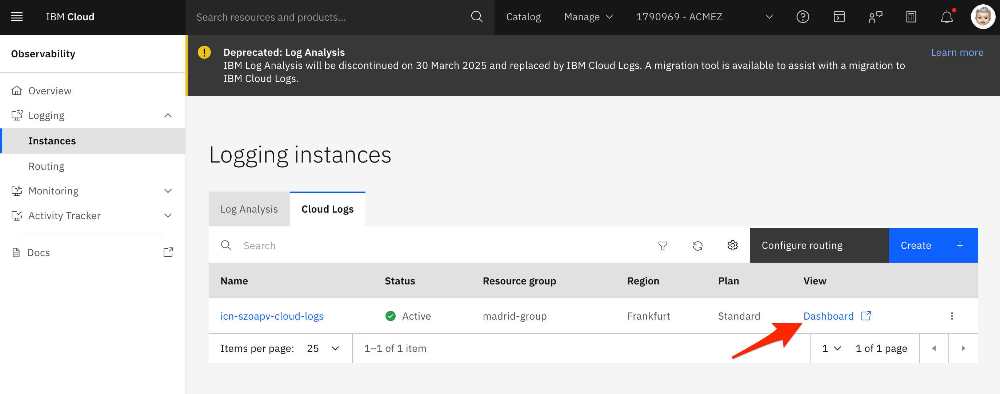

# Analyze your logs

IBM Cloud Logs, a log managment tool, turns log data into actionable insights, reducing operational costs and boosting system reliability. Fully integrated with IBM Cloud, IBM Cloud Logs allows quick issue detection, performance optimization, and ensures strong security compliance without traditional log indexing overhead.

In this hands-on lab, you will learn about IBM Cloud Logs features.

## Getting Started

The lab setup includes an instance of IBM Cloud Logs that you will use to explore some of its features. Platform data, platform logs and auditing events are collected automatically. 

Logs generated by a Kubernetes cluster are also available. A logging agent is deployed on the Kubernetes cluster to collect and send logs to the IBM Cloud Logs instance.

  

## Launch the Cloud Logs Dashboard

1. Go the Logging section under [Observability](https://cloud.ibm.com/observability/logging).

   > Alternatively, use the Navigation menu ☰ > Observability > Logging > Instances.

2. Launch the Logging Dashboard.

   

The UI opens in a new browser tab.

## Resources

Find more about IBM Log Analysis with LogDNA in the [IBM Cloud documentation](https://cloud.ibm.com/docs/services/Log-Analysis-with-LogDNA/index.html#getting-started).
