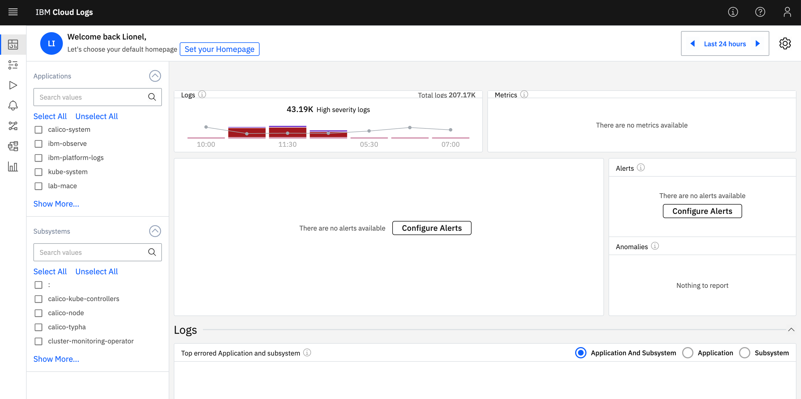
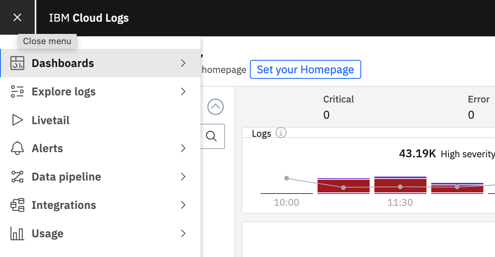
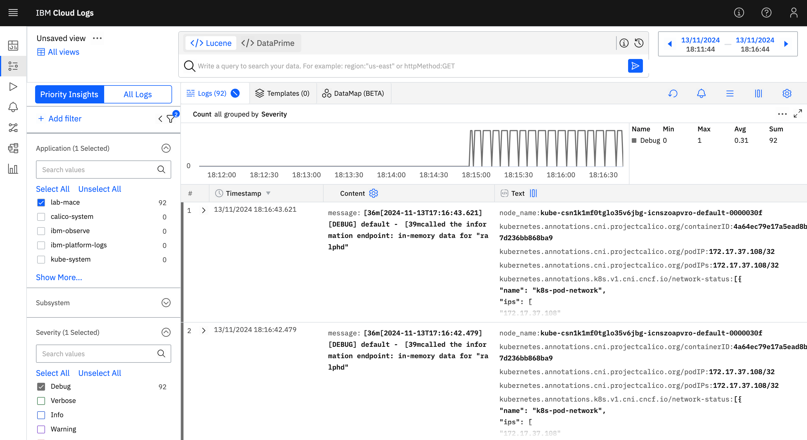

# Analyze your logs

IBM Cloud Logs, a log managment tool, turns log data into actionable insights, reducing operational costs and boosting system reliability. Fully integrated with IBM Cloud, IBM Cloud Logs allows quick issue detection, performance optimization, and ensures strong security compliance without traditional log indexing overhead.

  

The lab setup includes an instance of IBM Cloud Logs that you will use to explore some of its features. Platform data, platform logs and auditing events are collected automatically.

Logs generated by a Kubernetes cluster are also available. A logging agent is deployed on the Kubernetes cluster to collect and send logs to the IBM Cloud Logs instance.

In this hands-on lab, you will learn about IBM Cloud Logs features.

## Launch the Cloud Logs Dashboard

1. Go the Logging section under [Observability](https://cloud.ibm.com/observability/logging).

   > Alternatively, use the Navigation menu ☰ > Observability > Logging > Instances.

1. Launch the Logging Dashboard.

   

1. The UI opens in the Home dashboard is a predefined dashboard that includes the following information for the time frame selected for the dashboard:

   * The trend of high severity logs and their percentage of total logs.
   * The trend of metric ingestion.
   * A list of triggered alerts grouped by severity.
   * A list of anomalies grouped by type.
   * The applications and subsystems that generated the highest volume of errors and their template distributions.
   * The logs volumes grouped by severity.
   * The top 3 errors that occurred above their usual occurrence rates or occurred for the first time within the last 7 days.
   * Information on the application and subsystem combinations with the highest error rates.

   > By default the displayed timeframe is set to 24 hours, and the information included covers both logs and metrics.

   

   At a glance, you can see the type of logs that you are ingesting, their priority, the volumes per priority, the top errors, and the recent alerts that have been triggered.

1. Cloud Logs includes many different features grouped in the following sections.

   

## Explore logs

The patient application that you previously deployed in the OpenShift cluster within a namespace named after your username generates logs.

1. Let's re-use the same commmand we load in the section before to generate some requests, this will in turn generate logs.

   ```sh
   while sleep 1; do curl -s https://$HOST/info; done
   ```

1. Click on the **Logging** tab.

1. In the Cloud Logs dashboard, click **Explore logs** > **Logs**.

1. Under **Application**, select the namespace named after your username to view the logs you generated.

1. Change the **Severity** to **Debug**.

   

## Resources

Find more about IBM Log Analysis with LogDNA in the [IBM Cloud documentation](https://cloud.ibm.com/docs/services/Log-Analysis-with-LogDNA/index.html#getting-started).
