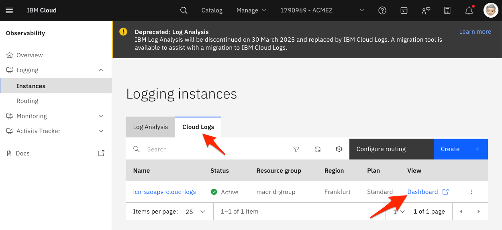

# Analyze your logs

IBM Cloud Logs, a log managment tool, turns log data into actionable insights, reducing operational costs and boosting system reliability. Fully integrated with IBM Cloud, IBM Cloud Logs allows quick issue detection, performance optimization, and ensures strong security compliance without traditional log indexing overhead.

  

The lab setup includes an instance of IBM Cloud Logs that you will use to explore some of its features. Platform data, platform logs and auditing events are collected automatically.

Logs generated by a Kubernetes cluster are also available. A logging agent is deployed on the Kubernetes cluster to collect and send logs to the IBM Cloud Logs instance.

In this hands-on lab, you will learn about IBM Cloud Logs features.

## Launch the Cloud Logs Dashboard

1. Go the Logging section under [Observability](https://cloud.ibm.com/observability/logging).

   > Alternatively, use the Navigation menu ☰ > Observability > Logging > Instances.

2. Launch the Logging Dashboard.

   

The UI opens in a new browser tab.

## Send logs

The patient application that you previously deployed in the OpenShift cluster within a namespace named after your username generates logs.

1. Let's re-use the same commmand we load in the section before to generate some requests, this will in turn generate logs.

   ```sh
   while sleep 1; do curl -s https://$HOST/info; done
   ```

1. Click on the **Logging** tab.

1. In the Cloud Logs dashboard, click **Explore logs** > **Logs**.

1. Under **Application**, select the namespace named after your username to view the logs you generated.

1. Change the **Severity** to **Debug**.

   

## Resources

Find more about IBM Log Analysis with LogDNA in the [IBM Cloud documentation](https://cloud.ibm.com/docs/services/Log-Analysis-with-LogDNA/index.html#getting-started).
