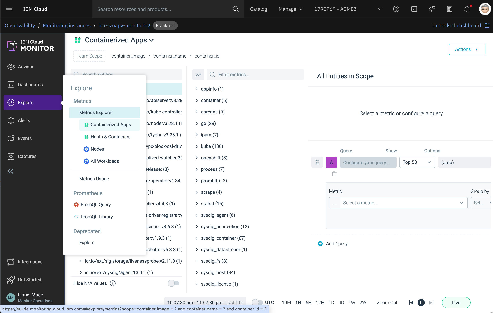
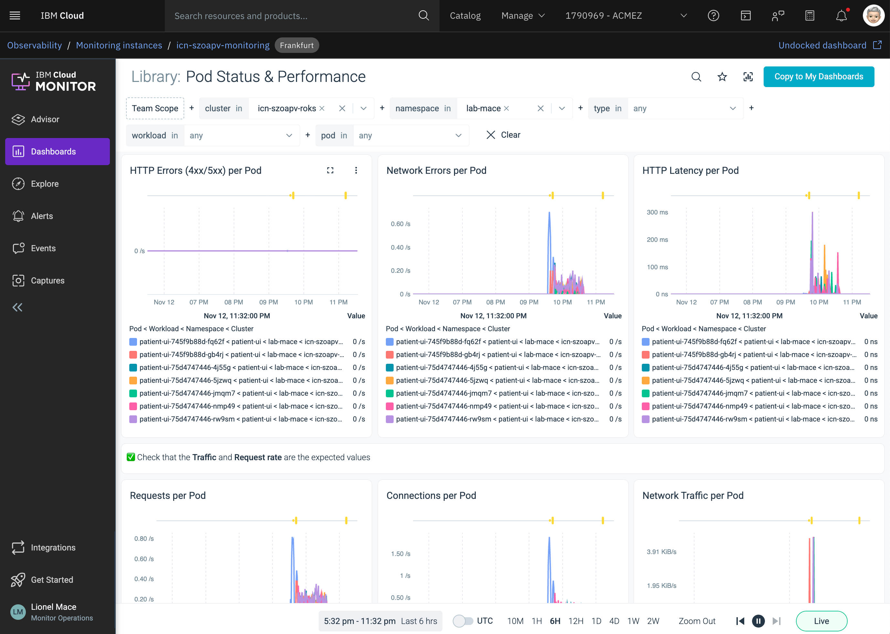

# Monitor your Cluster

IBM Cloud Monitoring with Sysdig is a co-branded cloud-native, and container-intelligence management system that you can include as part of your architecture.

Use views and dashboards to monitor your infrastructure, applications, and services. You can use pre-defined dashboards. You can also create custom dashboards through the Web UI or programmatically.

The following table lists the different types of pre-defined dashboards:

| Type | Description |
| :--- | :--- |
| Applications | Dashboards that you can use to monitor your applications and infrastructure components. |
| Host and containers | Dashboards that you can use to monitor resource utilization and system activity on your hosts and in your containers. |
| Network | Dashboards that you can use to monitor your network connections and activity. |
| Service | Dashboards that you can use to monitor the performance of your services, even if those services are deployed in orchestrated containers. |

In the next steps, you will learn how to use dashboards and metrics to monitor the health of your application.

## View the Monitoring dashboard

1. Go the Monitoring section under [Observability](https://cloud.ibm.com/observability/monitoring)

1. Launch the Monitoring Dashboard.

    

1. Navigate the Monitoring console to get metrics on your Kubernetes cluster, nodes, deployments, pods, containers.

1. Under the **Explore** section,select **Containerized Apps** to view raw metrics for all workloads running on the cluster.

   

1. Under **Explore**, select **Nodes**, search `patient-ui`. Look for the partientui pod entry.

   

1. Under **Dashboard**, select **Default Dashboards** &gt; **Applications**. Then select **HTTP** to get a global view of the cluster HTTP load.

1. Under Dashboard, select **Default Dashboards** &gt; **Hosts & Containers**. Then select **Overview by Host** to understand how nodes are currently performing.

## Explore the Pod Status and Performance

You can use the dashboard to monitor the CPU, Memory and traffic of your application components.

1. From the **Dashboards** tab, select **Pod Status and Performance** under the **Kubernetes** library

1. Select your cluster. Then, select the namespace where you deployed your sample app.

   

1. Check out the different panels.

## Explore the cluster and the node capacity

1. From the **Dashboards** tab, select **Cluster Capacity Planning** under the **Kubernetes** library

1. Select your cluster. Then, select the namespace where you deployed your sample app.

  

   Check the **Total CPU Capacity**. This is the CPU capacity that has been reserved for the node including system daemons.

   Check the **Total Allocatable CPU**. This is the CPU which is available for pods excluding system daemons.

   Check the **Total Pod CPU limit**. It should be less than the allocatable CPU of the node or cluster.

   Check the **Total Pod CPU Requested**. It is the amount of CPU that will be guaranteed for pods on the node or cluster.

   Check the **Total Pod CPU Usage**. It is the total amount of CPU that is used by all Pods on the node or cluster.

## Congratulations!

That's it, you're done with the Red Hat OpenShift on IBM Cloud workshop. Thanks for joining us!
