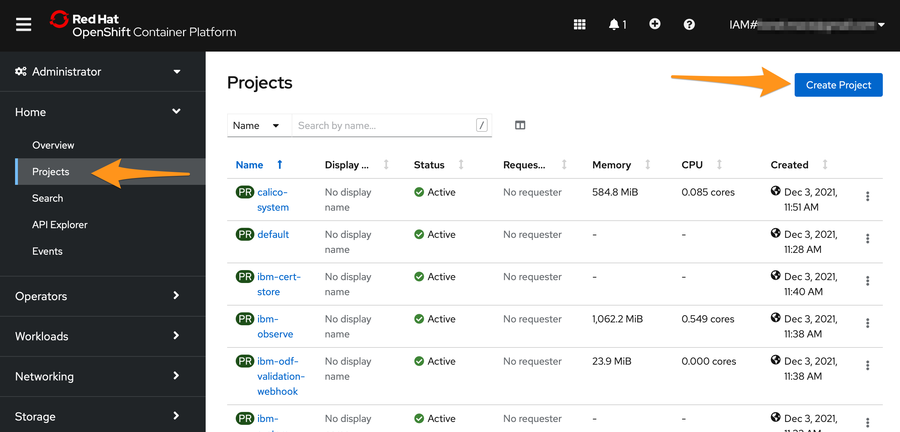
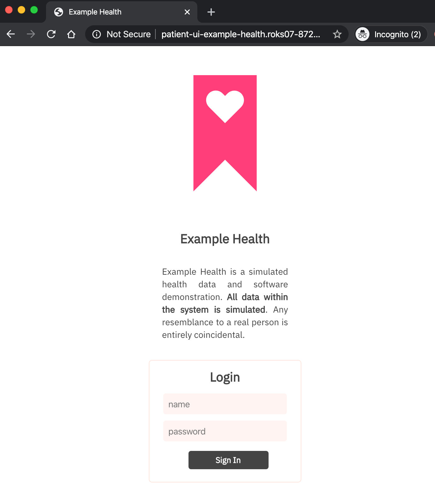

# Deploying an application

## Deploy Example Health into OpenShift

There's many ways to create a new application in OpenShift. If you're already a Kubernetes expert, you can stick with what you know and use YAML deployment files. However, OpenShift has greatly simplified the process of deploying apps into a cluster. 

Today, we'll demonstrate the "s2i" or "source to image" builder. This builder allows you to go from source code on GitHub to a running deployment.

1. Create a new project **example-health**:

   ```sh
    oc new-project example-health
   ```

   Output:

   ```
    Now using project "example-health" on server "https://c100-e.containers.cloud.ibm.com:32545".

    You can add applications to this project with the 'new-app' command. For example, try:

        oc new-app django-psql-example

    to build a new example application in Python. Or use kubectl to deploy a simple Kubernetes application:

        kubectl create deployment hello-node --image=gcr.io/hello-minikube-zero-install/hello-node
   ```

2. Next, deploy the application directly from GitHub into your cluster. This uses the OpenShift "s2i" or "source to image" strategy. Essentially, this build strategy combines a standard Node.js runtime \(a base image\) with your source code in GitHub. Our code needs a runtime to actually run -- the base image takes care of this. The base image exists on DockerHub, named `nodejs-10-centos7:latest`.
   * Run the following command to build the Docker image. Note the `~` separator between the base image and source repository. The `--context-dir` flag is used to define the folder where the app exists:

     ```sh
       oc new-app --name=patient-ui centos/nodejs-10-centos7~https://github.com/svennam92/node-s2i-openshift --context-dir='site'
     ```

     Output:

     ```
       --> Found Docker image 4028fd4 (3 weeks old) from Docker Hub for "centos/nodejs-10-centos7"

           Node.js 10 
           ---------- 
           Node.js 10 available as container is a base platform for building and running various Node.js 10 applications and frameworks. Node.js is a platform built on Chrome's JavaScript runtime for easily building fast, scalable network applications. Node.js uses an event-driven, non-blocking I/O model that makes it lightweight and efficient, perfect for data-intensive real-time applications that run across distributed devices.

           Tags: builder, nodejs, nodejs10

           * An image stream tag will be created as "nodejs-10-centos7:latest" that will track the source image
           * A source build using source code from https://github.com/IBM/node-s2i-openshift will be created
           * The resulting image will be pushed to image stream tag "patient-ui:latest"
           * Every time "nodejs-10-centos7:latest" changes a new build will be triggered
           * This image will be deployed in deployment config "patient-ui"
           * Port 8080/tcp will be load balanced by service "patient-ui"
           * Other containers can access this service through the hostname "patient-ui"

       --> Creating resources ...
           imagestream.image.openshift.io "patient-ui" created
           buildconfig.build.openshift.io "patient-ui" created
           deploymentconfig.apps.openshift.io "patient-ui" created
           service "patient-ui" created
       --> Success
           Build scheduled, use 'oc logs -f bc/patient-ui' to track its progress.
           Application is not exposed. You can expose services to the outside world by executing one or more of the commands below:
           'oc expose svc/patient-ui' 
           Run 'oc status' to view your app.
     ```

   * This command created an ImageStream, Deployment, a Pod, and a Service resource for the `Example-Health` app,

3. Reading the output, you'll notice that although a deployment and service is created, your application is not yet "exposed" to the outside world. To do so, run the following command:

   ```sh
    oc expose svc/patient-ui
   ```

   Output:

   ```
    route.route.openshift.io/patient-ui exposed
   ```

4. Make sure everything started up correctly. This might take a couple minutes -- look for the `deployed` status. You can also launch the dashboard and track it there.

   > To find the OpenShift dashboard URL again, run: `ic ks cluster get <cluster_name>` and look for `Public Service Endpoint URL`

   ```sh
    oc status
   ```

   Output:

   ```
    In project example-health on server https://c100-e.containers.cloud.ibm.com:32545

    http://patient-ui-example-health.<your_openshift_cluster>.us-south.stg.containers.appdomain.cloud to pod port 8080-tcp (svc/patient-ui)
    dc/patient-ui deploys istag/patient-ui:latest <-
        bc/patient-ui source builds https://github.com/ibm/patient-ui on istag/nodejs-10-centos7:latest 
        deployment #1 deployed 21 minutes ago - 1 pod
   ```

5. Start streaming the logs to see the build progress
    ```
    oc logs -f bc/patient-ui
    ```

## View the Example Health in the OpenShift console

1. In the OpenShift Web console, switch from **Administrator** to **Developer** view and navigate to **Topology**. Select your project

    

2. You should see the app you just deployed.

    

3. Select the app. You should see a single deployment config where you can see your Pods, Builds, Services and Routes.

    * **Pods**: Your Node.js application containers
    * **Builds**: The auto-generated build that created a Docker image from your Node.js source code, deployed it to the OpenShift container registry, and kicked off your deployment config.
    * **Services**: Tells OpenShift how to access your Pods by grouping them together as a service and defining the port to listen to
    * **Routes**: Exposes your services to the outside world using the LoadBalancer provided by the IBM Cloud network

4. Click on **View Logs** next to your completed Build. This shows you the process that OpenShift took to install the dependencies for your Node.js application and build/push a Docker image.

    

5. Click back to the **Topology** and select your app again. Click on the url under **Routes** to open your application with the URL.

    

You've completed the first exercise! Let's recap -- in this exercise, you:

* Deployed the "Example Health" Node.js application directly from GitHub into your cluster 
  * Used the "Source to Image" strategy provided by OpenShift
* Deployed an end-to-end development pipeline 
  * New commits that happen in GitHub can be pushed to your cluster with a simple \(re\)build
* Looked at your app in the OpenShift console.

## What's Next?

Let's dive into some Day 1 OpenShift Operations tasks, starting with Monitoring and Logging

