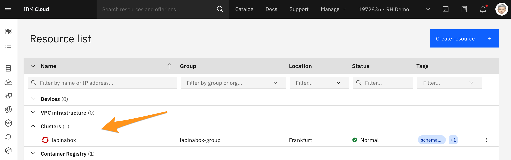
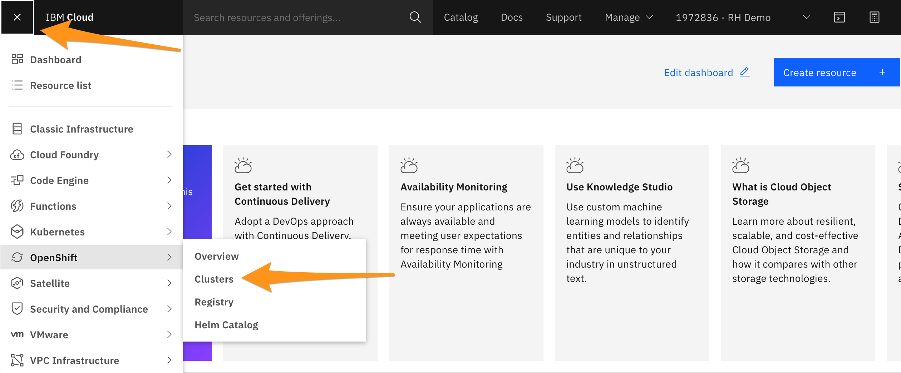
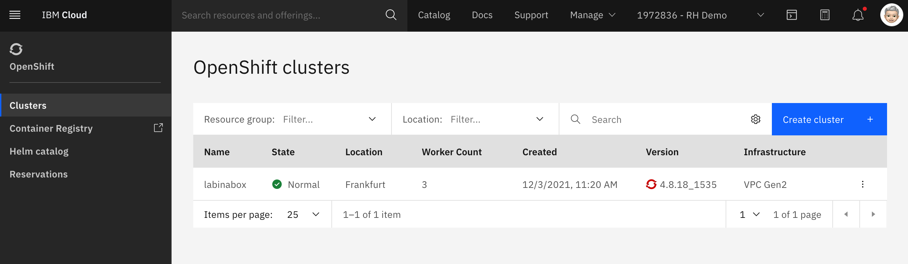

# Access the OpenShift Console

In this section, you will get access to an IBM Cloud Lab account which contains pre-provisioned clusters. Each lab attendee will be granted access to one cluster.

## Navigate to the OpenShift Console

1. Go to the list of [IBM Cloud Resources](https://cloud.ibm.com/resources).

    

2. Expand the section **Clusters**. Click on the cluster that has been assigned to you.

    

3. You can also access the cluster directly from the top menu bar.

   

4. Find your cluster in the list of OpenShift clusters [IBM Cloud Clusters Dashboard](https://cloud.ibm.com/kubernetes/clusters?platformType=openshift)
 
    

5. Have a look at the cluster overview!

    

6. Click on **OpenShift web console** on the top right to launch the web console.

    
