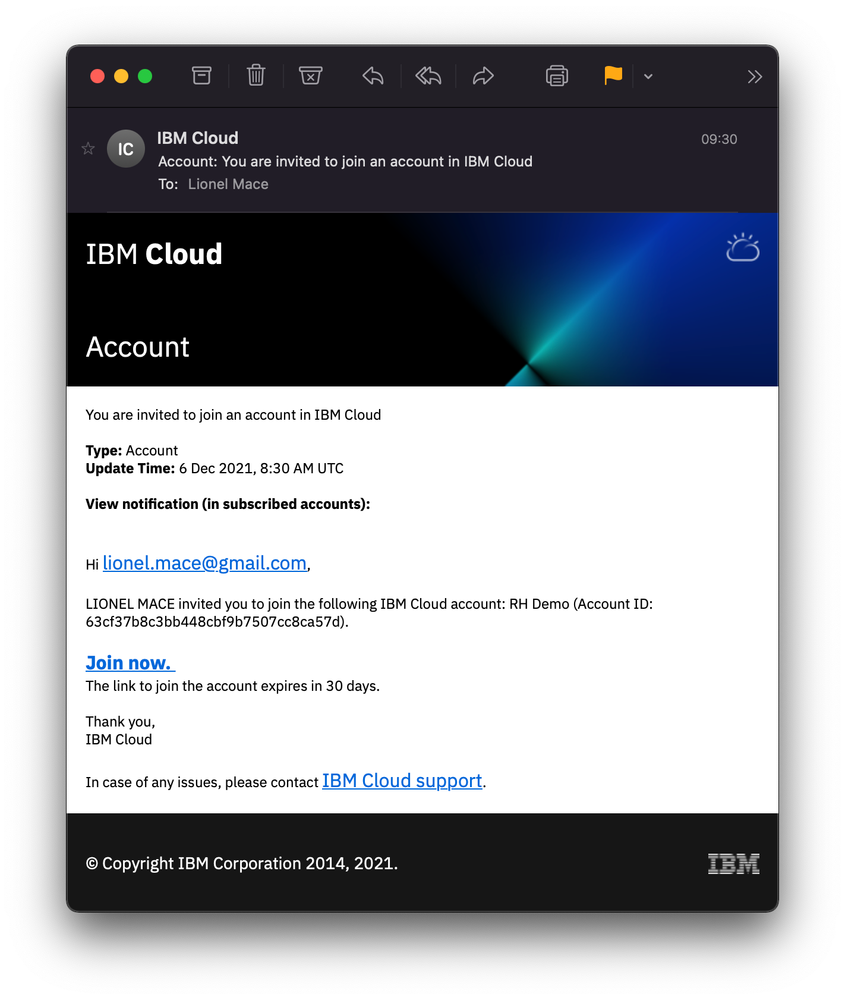

# Join an account in IBM Cloud

In this section, you will login to your own IBM Cloud account.

## Join an existing account in IBM Cloud

1. If you've been invited to an account, check your email. You should have received an email similar to this.

    

2. You need to access the invite to be able to log into this existing IBM Cloud account.

3. Once you accepted the invite, you will be able to access [https://cloud.ibm.com](https://cloud.ibm.com)

 When joining an existing account, you do NOT require to enter any credit card information. 

## Create your own account

 If you have been invited to an account, creating an account is optionnal. 

1. Register for your own account: [http://cloud.ibm.com/registration](http://cloud.ibm.com/registration)
