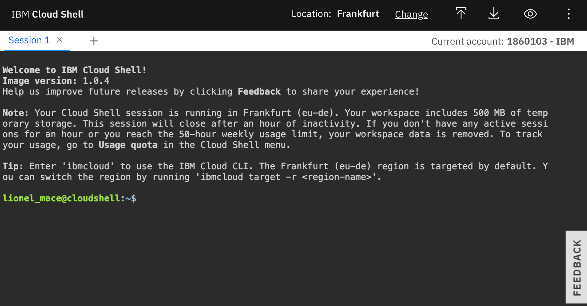
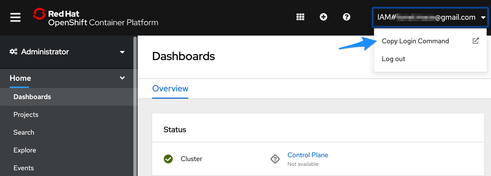

# Access the cluster using the command line (CLI)

To easily connect to the cluster, you need the OpenShift CLI `oc` that exposes commands for managing your applications, as well as lower level tools to interact with each component of your system. 

This topic guides you through getting started with the CLI, including installation and logging in.

## Use IBM Cloud Shell

To avoid installing the command line, the recommended approach is to use the IBM Cloud Shell is a cloud-based shell workspace that you can access through your browser.

It's preconfigured with the full IBM Cloud CLI and tons of plug-ins and tools that you can use to manage apps, resources, and infrastructure.

1. In the Console menu bar, click the IBM Cloud Shell icon to start a session

    

1. A session starts and automatically logs you in through the IBM Cloud CLI.

    


## Connect to the OpenShift cluster

1. In the OpenShift web console, click on the email/ID in the upper right. Choose the _Copy Login Command_ option.

    


1. In a Shell termimal, paste the `oc login` command you copied from the web console.

    You should see a success message similar to the one below:

    ```bash
    oc login https://c100-e.us-south.containers.cloud.ibm.com:30360 --token=NYVkVysxxxxxxxxxxxxxxxxxxxxRQa8tM

    Logged into "https://c100-e.us-south.containers.cloud.ibm.com:30360" as "IAM#firstname.lasname@ibm.com" using the token provided.

    You have access to the following projects and can switch between them with 'oc project <projectname>'
    ```
Your CLI is now connected to your Red Hat OpenShift cluster running in IBM Cloud.


## Validate cluster access using `oc` commands

1. View projects

    ```bash
    oc get projects
    ```

You've completed the getting started! Let's recap -- in this section, you:

* Got an OpenShift cluster and accessed its Web Console.
* Connected your local CLI to a running OpenShift cluster on IBM Cloud