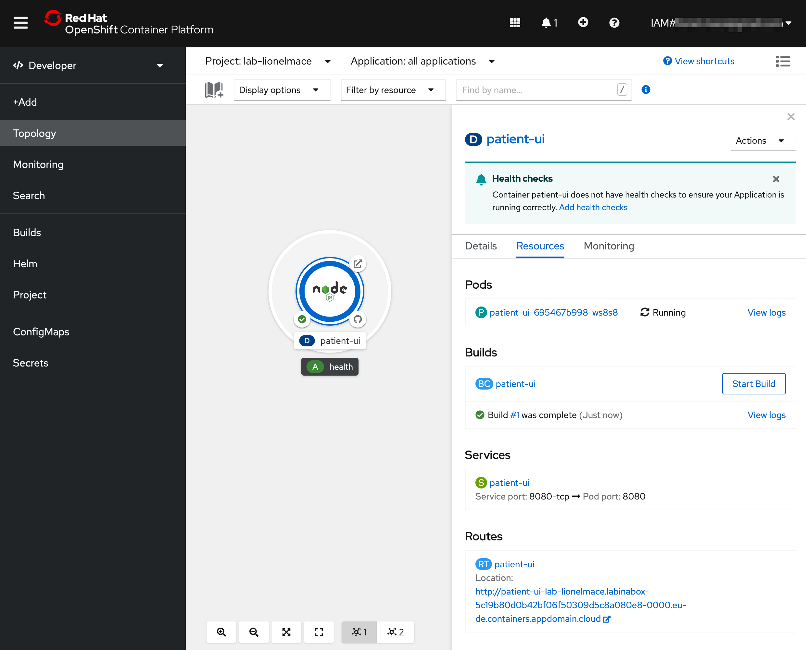
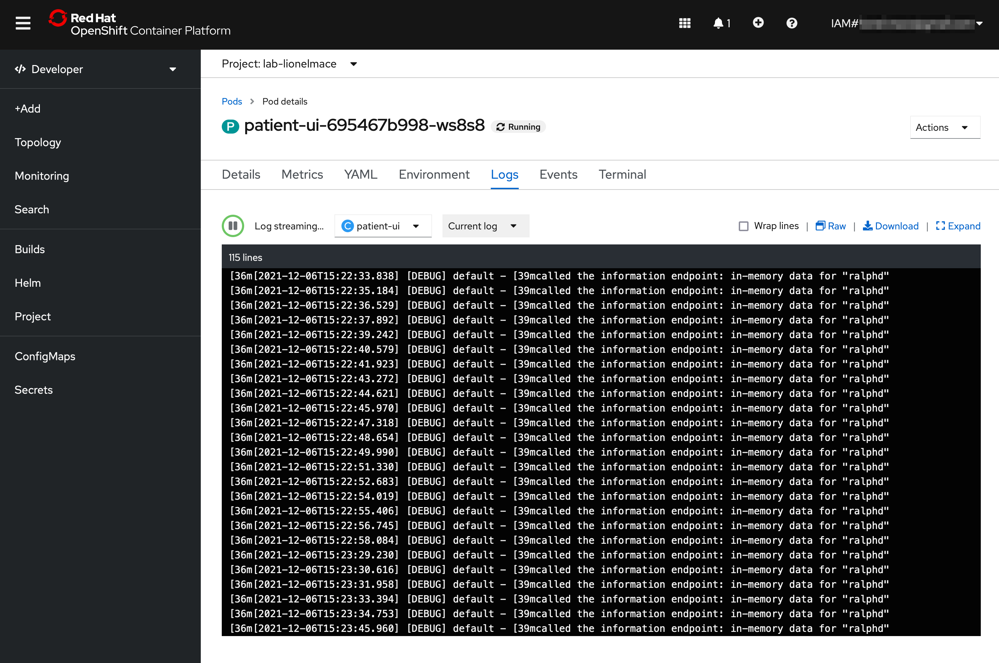
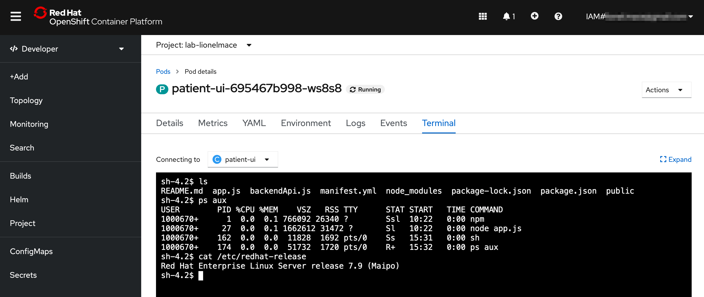

# Logging

In this exercise, we'll explore the out-of-the-box logging capabilities that are offered in OpenShift.

## Simulate Load on the Application

Let's simulate some load on our application.

1. Define an environment variable named `MYPROJECT` and set the project name by replacing `<your-lastname>` with your own last name. This project is the same project as the one used in the console to deploy the app.

    ```sh
    export MYPROJECT=lab-<your-lastname>
    ```

1. Make sure you're connected to the project where you deployed your app.

    ```sh
    oc project $MYPROJECT
    ```

1. Retrieve the public route to access your Example Health application:

    ```sh
    oc get routes
    ```

    Output looks similar to this:

    ```sh
    NAME         HOST/PORT                                                                                                 PATH      SERVICES     PORT       TERMINATION   WILDCARD
    patient-ui   patient-ui-example-health.roks07-872b77d77f69503584da5a379a38af9c-0000.eu-de.containers.appdomain.cloud             patient-ui   8080-tcp                 None
    ```

1. Let's store the above host into an environment variable named `HOST`.

    ```sh
    export HOST=$(oc get routes | sed -n '2 p' | awk '{ print $2}')
    ```

1. Run the following script which will endlessly spam our app with requests.

    ```sh
    while sleep 1; do curl -s https://$HOST/info; done
    ```

1. Hitting the `/info` endpoint will trigger some logs from our app.

    

## OpenShift Logging

Since we only created one pod, seeing our logs will be straight forward.

1. Ensure that you're in the **Developer** view. Then, navigate to **Topology**.

1. Navigate to your Pod by selecting your app, then clicking the name of the Pod under **Pods**.

    

1. Click on **View Logs** next to your Pods to see streaming logs from your running application. If you're still generating traffic, you should see log messages for every request being made.

    

## OpenShift Terminal

One of the great things about Kubernetes is the ability to quickly debug your application pods with SSH terminals. This is great for development, but generally is not recommended in production environments. OpenShift makes it even easier by allowing you to launch a terminal directly in the dashboard.

1. Navigate to your Pod by selecting your app, then click the name of the Pod under **Pods**.

   

2. Switch to the **Terminal** tab

   

3. Run the following Shell commands:

| Command | Description |
| :--- | :--- |
| ls | List the project files. |
| ps aux | List the running processes. |
| cat /etc/redhat-release | Show the underlying OS. |
