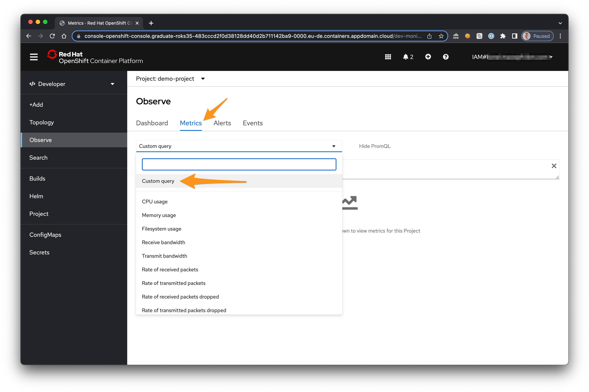
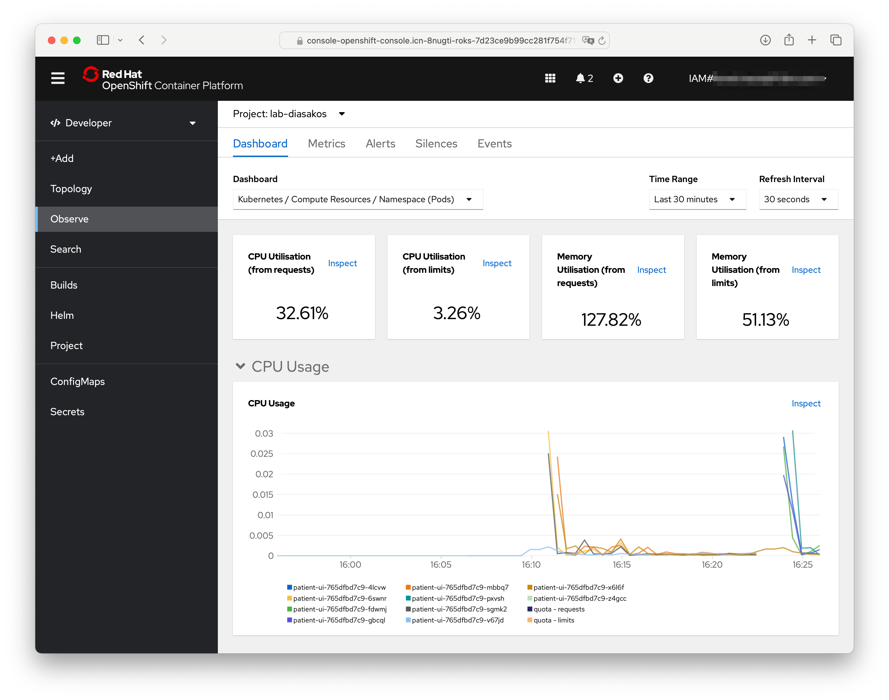

# Monitoring

In this section, you will learn to monitor the health and performance of your application. OpenShift Container Platform ships with a pre-configured and self-updating monitoring stack that is based on the Prometheus open source project and its wider eco-system. It provides monitoring of cluster components and ships with a set of Grafana dashboards

## Access Prometheus

1. In the **Developer** perspective, go to the **Monitoring Dashboard** to review the CPU, Memory usage and more

    

1. Let's re-use the same commmand we load in the section before to generate some requests, this will in turn generate data into Prometheus.

    ```sh
    while sleep 1; do curl -s http://$HOST/info; done

1. Swith to the `Metrics` tab

    

1. Create a `custom Query` to see the total container cpu usage in seconds on a Graph.

    ```sh
    sum(node_namespace_pod_container:container_cpu_usage_seconds_total:sum_rate{namespace="<MYPROJECT>"}) by (container)
    ```

1. The following graph should appear

    

1. The **Events** view is useful for identifying the timeline of events and finding potential error messages. When tracking the state of a new rollout, managing existing assets, or even something simple like exposing a route, the Events view is critical in identifying the timeline of activity. This becomes even more useful when considering that multiple operators may be working against a single cluster.

    

You'll want to refer to this view throughout the lab. Almost all actions we take in in OpenShift will result in an event being fired in this view. As it is updated real-time, it's a great way to track changes to state.

## Access Grafana

Red Hat OpenShift on IBM Cloud comes with [Grafana](https://grafana.com/) preinstalled.

1. To retrieve the web UIs of Graphan, run the command

    ```sh
    oc get routes -n openshift-monitoring | grep grafana | awk '{ print $2}'
    ```

    You should be getting something similar to this

    ```sh
    grafana-openshift-monitoring.labinabox-5c19b80d0b42bf06f50309d5c8a080e8-0000.eu-de.containers.appdomain.cloud
    ```

2. Open this url to launch the Grafana dashboard. You'll be asked to login with OpenShift and then click through some permissions.

    

3. In the Grafana dashboard, click the search icon in the left, and type **Kubernetes / Compute Resources / Namespace (Pods)**.

    

4. For the **Namespace** field, choose your project which is the name of the project your app resides in.

5. You should be able to see the CPU and Memory usage for your application.

    

    > In production environments, this is helpful for identifying the average amount of CPU or Memory your application uses, especially as it can fluctuate through the day. We'll use this information in the next exercise to set up auto-scaling for our pods.