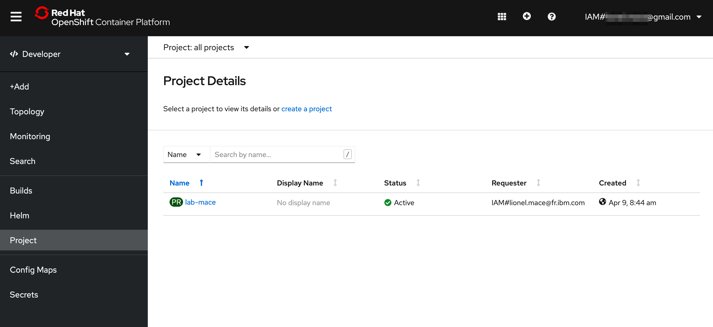
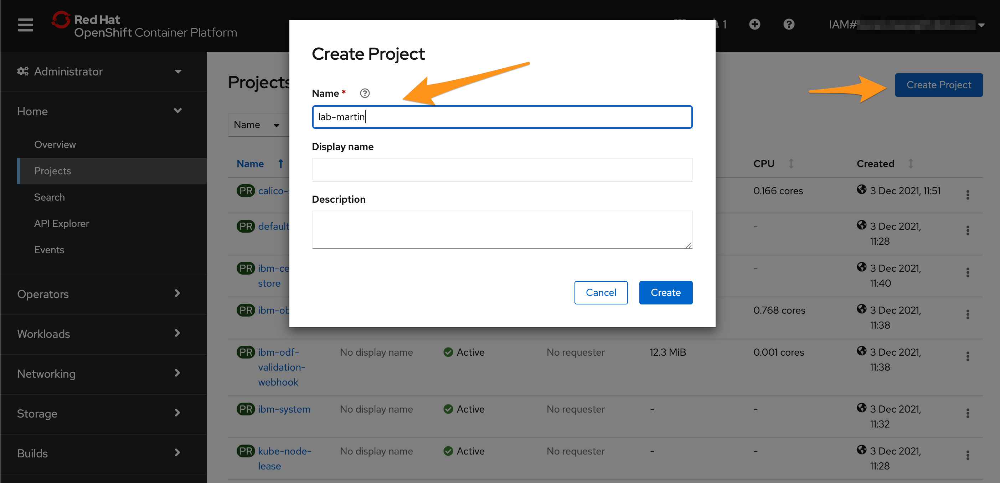
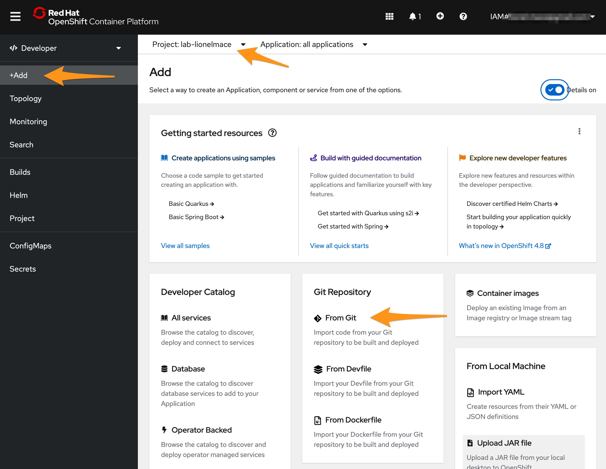
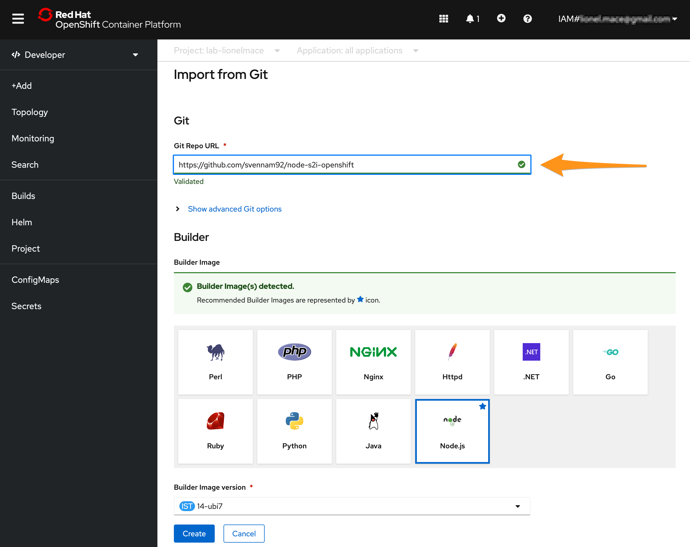
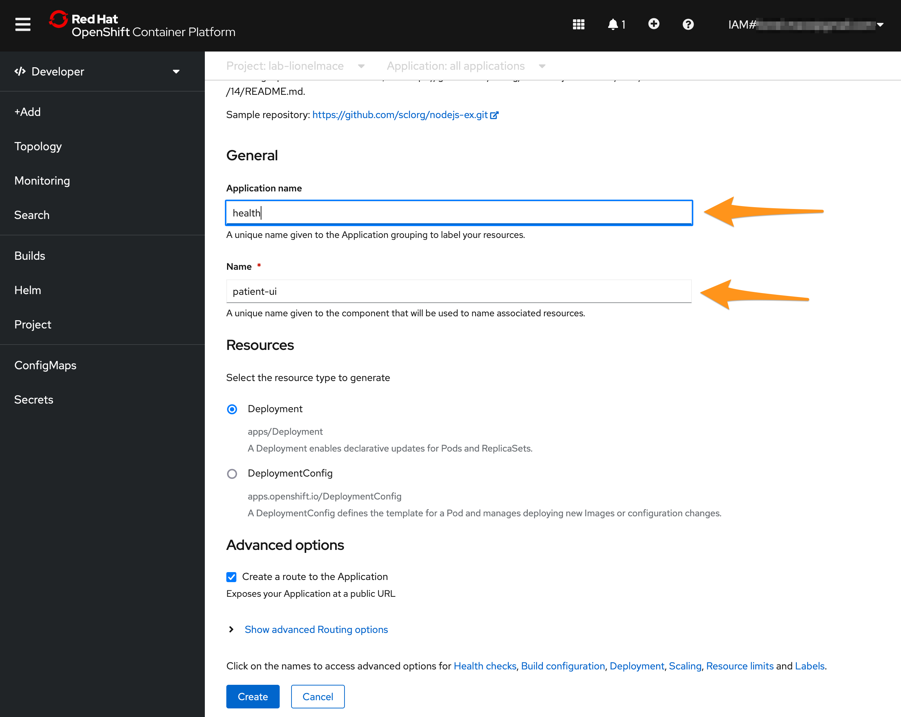
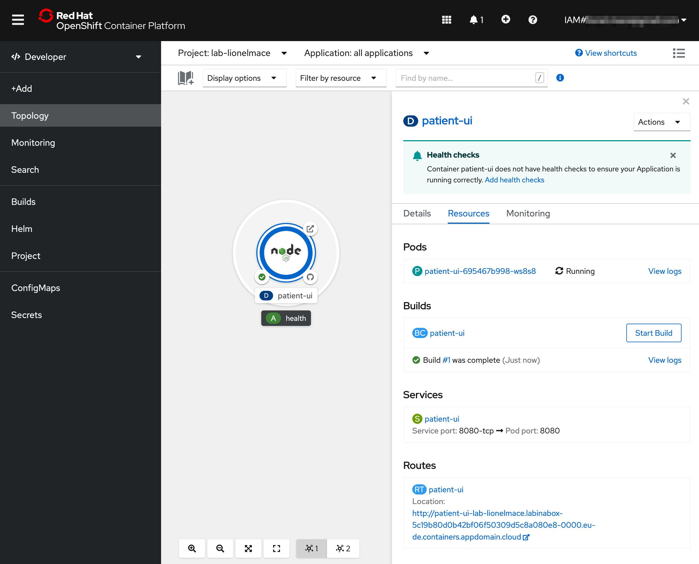
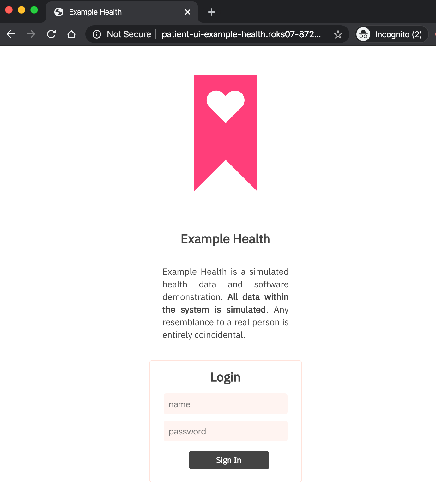

# Deploying an application

In this exercise, you'll deploy a simple Node.js Express application - "Example Health". Example Health is a simple UI for a patient health records system. We'll use this example to demonstrate key OpenShift features throughout this workshop. You can find the sample application GitHub repository here: [https://github.com/svennam92/node-s2i-openshift](https://github.com/svennam92/node-s2i-openshift)

## Deploy Example Health

1. Launch the `OpenShift web console`.

    

1. Select the **Project** view to display all the projects. This view might be empty based on your permission.

    

1. Create a new project by selecting **Create Project**. Call the project "example-health".

     If you've been invited to a lab account where the project was already created, skip this project creation step and the select the project lab-yourlastname. 

    

1. Access the **Project Details** under the section **More** on the left side menu.

    

1. Switch from the Administrator to the **Developer** view. Make sure your project is selected.

    

1. Select **Topology** in the left side menu. Let's deploy the application by selecting **From Git**.

1. Enter the repository `https://github.com/svennam92/node-s2i-openshift` in the Git Repo URL field.

    

    Note that the builder image automatically detected the language Node.js.

1. Name your application such as `patient-ui`. Leave the application name field empty and hit **Create** at the bottom of the window to build and deploy the application.

    

    Your application is being deployed.

## View the Example Health

1. You should see the app you just deployed.

    

1. Select the app. You should see a single Deployment where you can see your Pods, Builds, Services and Routes.

    

    * **Pods**: Your Node.js application containers
    * **Builds**: The auto-generated build that created a Docker image from your Node.js source code, deployed it to the OpenShift container registry, and kicked off your deployment config.
    * **Services**: Tells OpenShift how to access your Pods by grouping them together as a service and defining the port to listen to
    * **Routes**: Exposes your services to the outside world using the LoadBalancer provided by the IBM Cloud network

1. Click on **View Logs** next to your completed Build. This shows you the process that OpenShift took to install the dependencies for your Node.js application and build/push a Docker image.

    

    You should see that looks like this:

    ```bash
    Successfully pushed image-registry.openshift-image-registry.svc:5000/example-health/patient-ui@sha256:f9385e010144f36353a74d16b6af10a028c12d005ab4fc0b1437137f6bd9e20a
    Push successful
    ```

1. Click back to the **Topology** and select your app again. Click on the url under **Routes** to open your application with the URL.

    

    You can enter any strings for username and password, for instance `test:test` because the app is running in demo mode.

Congrats! You've deployed a `Node.js` app to OpenShift Container Platform.

You've completed the first exercise! Let's recap -- in this exercise, you:

* Deployed the "Example Health" Node.js application directly from GitHub into your cluster
* Used the "Source to Image" strategy provided by OpenShift
* Deployed an end-to-end development pipeline
* New commits that happen in GitHub can be pushed to your cluster with a simple \(re\)build
* Looked at your app in the OpenShift console.

## What's Next?

Let's dive into some Day 1 OpenShift Operations tasks, starting with Monitoring and Logging
