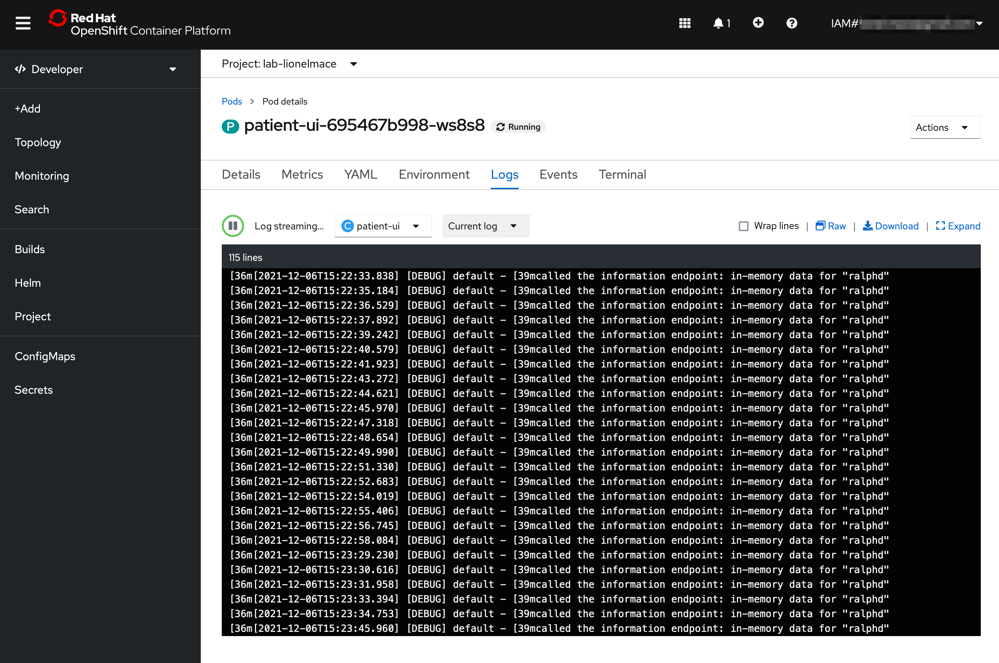
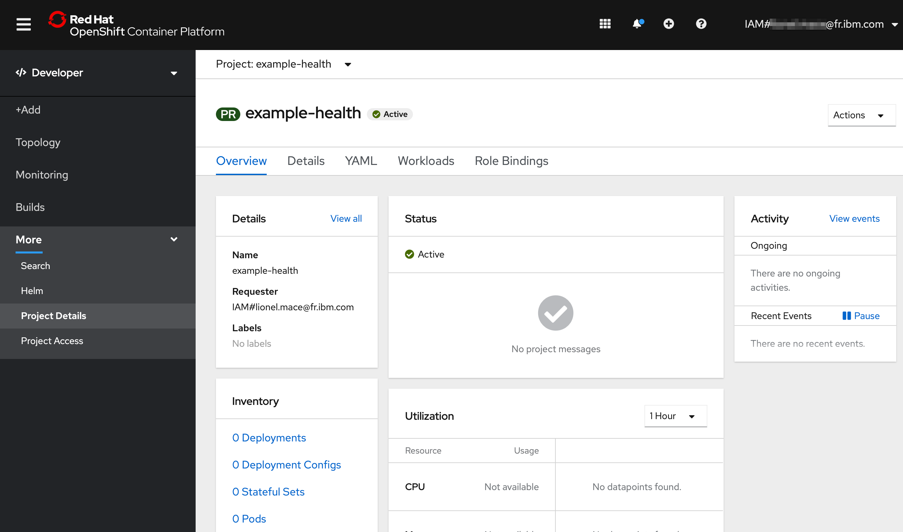
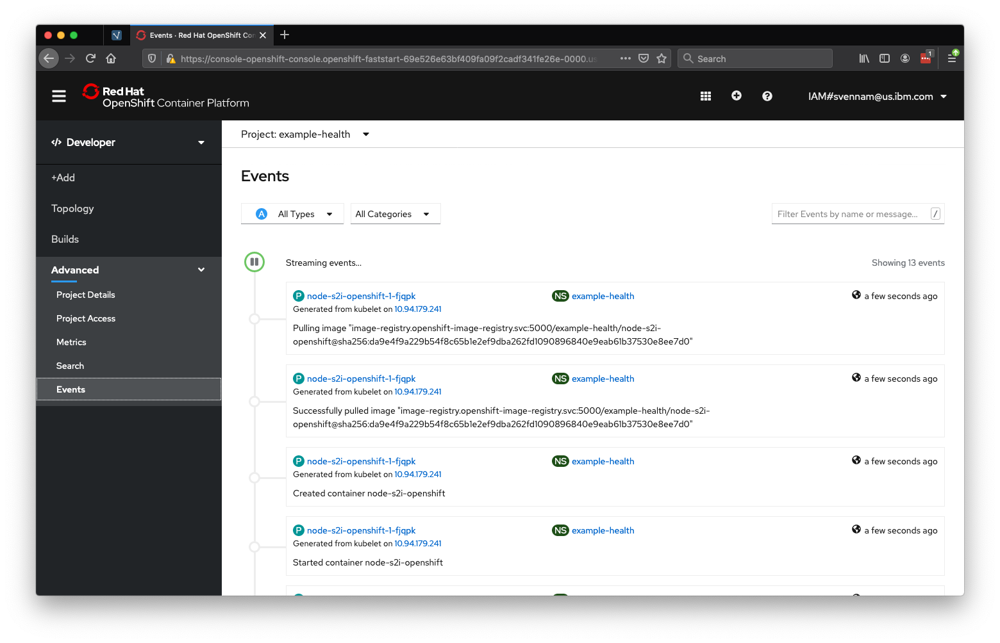

# Logging and monitoring

In this exercise, we'll explore the out-of-the-box logging and monitoring capabilities that are offered in OpenShift.

## Simulate Load on the Application

Let's simulate some load on our application.

1. First, make sure you're connected to the project where you deployed your app.

    ```sh
    oc project example-health
    ```

1. Retrieve the public route to access your Example Health application:

    ```
    oc get routes
    ```
    Output looks similar to this (_remember not to copy this exact host_):
    ```
    NAME         HOST/PORT                                                                                                 PATH      SERVICES     PORT       TERMINATION   WILDCARD
    patient-ui   patient-ui-example-health.roks07-872b77d77f69503584da5a379a38af9c-0000.eu-de.containers.appdomain.cloud             patient-ui   8080-tcp                 None
    ```

1. Run the following script which will endlessly spam our app with requests:

    With Linux/MacOS:

    ```bash
    while sleep 1; do curl -s http://<host>/info; done
    ```
    
    With Windows:
    
    ```bash
    while($true){curl http://<host>/info}
    ```

We're hitting the `/info` endpoint which will trigger some logs from our app. For example:

[`http://patient-ui-health-example.myopenshift-xxx.us-east.containers.appdomain.cloud/info`](http://patient-ui-health-example.myopenshift-341665-66631af3eb2bd8030c5bb56d415b8851-0001.us-east.containers.appdomain.cloud/jee.html)

## OpenShift Logging

Since we only created one pod, seeing our logs will be straight forward.

1. Ensure that you're in the **Developer** view. Then, navigate to **Topology**.

2. Navigate to your Pod by selecting your app, then clicking the name of the Pod under **Pods**.

    
   
3. Click on **View Logs** next to your Pods to see streaming logs from your running application. If you're still generating traffic, you should see log messages for every request being made.

    

## OpenShift Terminal

One of the great things about Kubernetes is the ability to quickly debug your application pods with SSH terminals. This is great for development, but generally is not recommended in production environments. OpenShift makes it even easier by allowing you to launch a terminal directly in the dashboard.

1. Navigate to your Pod by selecting your app, then clicking the name of the Pod under **Pods**.

   

2. Switch to the **Terminal** tab

   

3. Run the following Shell commands:

| Command | Description | 
| :--- | :--- |
| ls | List the project files. |
| ps aux | List the running processes. |
| cat /etc/redhat-release | Show the underlying OS. |

## OpenShift Monitoring

When deploying new apps, making configuration changes, or simply inspecting the state of your cluster, the Project-scope Dashboard gives Developer Clear Insights.

1. Access the **Dashboard** now by going to the **Advanced > Project Details** tab on the left side menu.

    

2. You can also dive in a bit deeper - the **Events** view is useful for identifying the timeline of events and finding potential error messages. When tracking the state of a new rollout, managing existing assets, or even something simple like exposing a route, the Events view is critical in identifying the timeline of activity. This becomes even more useful when considering that multiple operators may be working against a single cluster.

    

You'll want to refer to this view throughout the lab. Almost all actions we take in in OpenShift will result in an event being fired in this view. As it is updated real-time, it's a great way to track changes to state.

