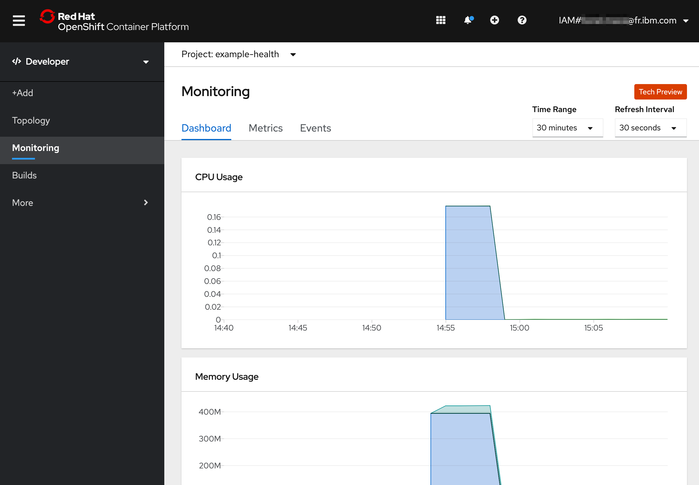
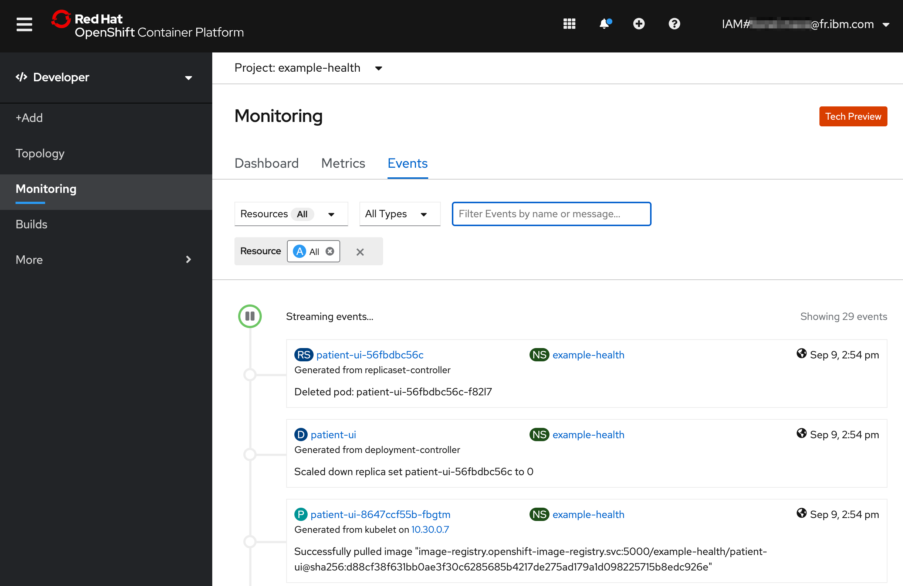

# Monitoring

In this exercise, we'll explore the built-in and third-party monitoring dashboards that are installed for free with OpenShift!

## Developer Monitoring

1. In the **Developer** perspective, go to the **Dashboard** to review the CPU, Memory usage and more

    

2. You can also dive in a bit deeper - the **Events** view is useful for identifying the timeline of events and finding potential error messages. When tracking the state of a new rollout, managing existing assets, or even something simple like exposing a route, the Events view is critical in identifying the timeline of activity. This becomes even more useful when considering that multiple operators may be working against a single cluster.

    

You'll want to refer to this view throughout the lab. Almost all actions we take in in OpenShift will result in an event being fired in this view. As it is updated real-time, it's a great way to track changes to state.

## Grafana

Red Hat OpenShift on IBM Cloud comes with [Grafana](https://grafana.com/) preinstalled.

1. Get started by switching to the **Administrator** perspective:

    

2. Navigate to **Monitoring > Dashboards** in the left-hand bar. You'll be asked to login with OpenShift and then click through some permissions.

    

3. You should then see your Grafana dashboard. Hit **Home** on the top left, and choose **Kubernetes / Compute Resources / Namespace (Pods)**.

    

4. For the **Namespace** field, choose `example-health` which is the name of the project your app resides in.

5. You should be able to see the CPU and Memory usage for your application. In production environments, this is helpful for identifying the average amount of CPU or Memory your application uses, especially as it can fluctuate through the day. We'll use this information in the next exercise to set up auto-scaling for our pods.

    
