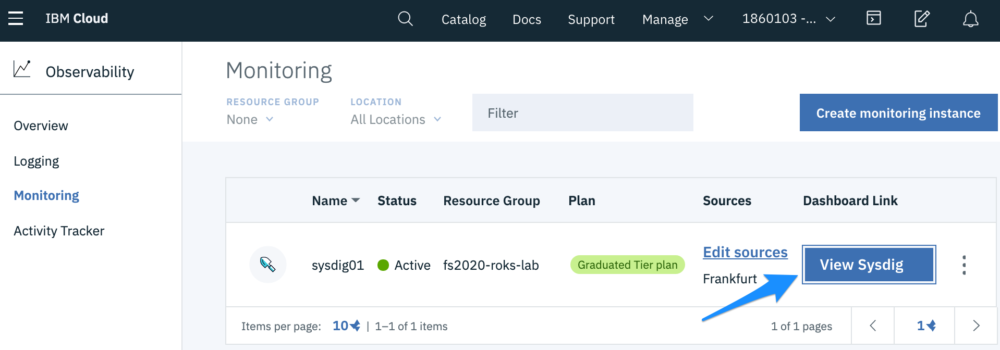
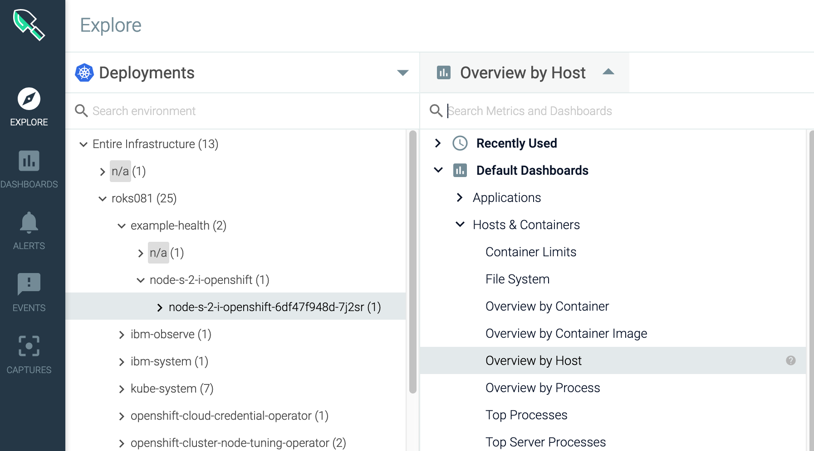

# Monitor your Cluster with SysDig

IBM Cloud Monitoring with Sysdig is a co-branded cloud-native, and container- intelligence management system that you can include as part of your IBM Cloud architecture. Use it to gain operational visibility into the performance and health of your applications, services, and platforms. It offers administrators, DevOps teams, and developers full stack telemetry with advanced features to monitor and troubleshoot performance issues, define alerts, and design custom dashboards. IBM Cloud Monitoring with Sysdig is operated by Sysdig in partnership with IBM. [Learn more](https://cloud.ibm.com/docs/Monitoring-with-Sysdig?topic=Sysdig-getting-started).

In the next steps, you will learn how to use dashboards and metrics to monitor the health of your application.

## View SysDig pre-defined views and dashboards

Use views and dashboards to monitor your infrastructure, applications, and services. You can use pre-defined dashboards. You can also create custom dashboards through the Web UI or programmatically. You can backup and restore dashboards by using Python scripts.

The following table lists the different types of pre-defined dashboards:

| Type | Description | 
| :--- | :--- |
| Applications | Dashboards that you can use to monitor your applications and infrastructure components. |
| Host and containers | Dashboards that you can use to monitor resource utilization and system activity on your hosts and in your containers. |
| Network | Dashboards that you can use to monitor your network connections and activity. | 
| Service | Dashboards that you can use to monitor the performance of your services, even if those services are deployed in orchestrated containers. | 
| Topology | Dashboards that you can use to monitor the logical dependencies of your application tiers and overlay metrics. | 

## Complete the Sysdig installation wizard

1. Launch the Sysdig web UI.

    

2. In the Sysdig Welcome wizard, click **Next**
   

3. Select **Kubernetes | GKE | OpenShift** as the installation method.
   

4. You should see a message `You have X agents connected`. Click **GO TO NEXT STEP**. 
   

5. Setup is complete. Click **LET'S GET STARTED**
   

6. Select **Next**
   

7. Finally **Complete Onboarding**

   

## View the Sysdig dashboard

1. Navigate the Sysdig console to get metrics on your Kubernetes cluster, nodes, deployments, pods, containers.

2. Under the **Explore** section,select **Containerized Apps** to view raw metrics for all workloads running on the cluster.

   

3. Under **Explore**, select **Nodes**, search `patient-ui`. Look for the partientui pod entry.

   

4. Under **Dashboard**, select **Default Dashboards** &gt; **Applications**. Then select **HTTP** to get a global view of the cluster HTTP load.

5. Under Dashboard, select **Default Dashboards** &gt; **Hosts & Containers**. Then select **Overview by Host** to understand how nodes are currently performing.

## Explore the normal traffic flow of the application

You can use the **Connection Table** dashboard to monitor how data flows between your application components.

1. From the **Explore** tab, select **Deployments**.
2. Select your cluster (e.g. roks081). Then, select the namespace where you deployed your sample app.
3. Select the _patientui_ pod entry.
4. Select **Default Dashboards**.

   

5. Check out the two dashboards under **Hosts & Containers**:
   * **Overview by Host**
   * **Overview by Container**.

## Explore the cluster and the node capacity

1. From the **Explore** tab, select **Deployments**.
2. Select your cluster (e.g. roks081). Then, select the namespace where you deployed your sample app.
3. Select the _patientui_ pod entry.
4. Select **Default Dashboards**.
5. Select **Kubernetes > Kuberentes Cluster and Node Capacity**. 

   

   Check the **Total CPU Capacity**. This is the CPU capacity that has been reserved for the node including system daemons.

   Check the **Total Allocatable CPU**. This is the CPU which is available for pods excluding system daemons.

   Check the **Total Pod CPU limit**. It should be less than the allocatable CPU of the node or cluster.

   Check the **Total Pod CPU Requested**. It is the amount of CPU that will be guaranteed for pods on the node or cluster.

   Check the **Total Pod CPU Usage**. It is the total amount of CPU that is used by all Pods on the node or cluster.

## Explore the Network

1. From the **DASHBOARDS** tab, select **Default Dashboards**. Then, select **Network > Overview**.

   The following dashboard is displayed. It shows information about all resources that are monitored thorugh the instance.

   

2. Change the scope of the dashboard to display information about your openshift cluster. Select **Edit scope** on the right side and change it:

    

    The dashboard now shows information about the ibm-observe namespace.

    

## Congratulations!

That's it, you're done with the Red Hat OpenShift 4.3 on IBM Cloud workshop. Thanks for joining us!


Find more about IBM Cloud Monitoring with Sysdig in the [IBM Cloud documentation](https://cloud.ibm.com/docs/services/Monitoring-with-Sysdig/index.html#getting-started).
